# Appendix A – Detailed Financial Model

---

## **Financial Model Executive Summary**

The x-Change financial model demonstrates a **capital-efficient, high-margin fintech infrastructure business** achieving profitability within two years and self-funded scalability thereafter.  
A ₱100 million equity infusion fully capitalizes the venture through break-even and nationwide rollout, with no additional financing required before Year 3.  
By Year 5, the company sustains **₱231 million annual revenue**, **₱83 million net profit**, and cumulative retained earnings exceeding ₱130 million—delivering a **21 % IRR**, **31 % average ROIC**, and **≈8–11× exit valuation multiple** typical of regional fintech peers.  
The model reflects the expanded **three-voucher-type architecture** (redeemable, payable, settlement) and an addressable market of **₱8+ trillion** across disbursement, collection, and conditional settlement verticals.

---

## **Financial Top Sheet (₱ Millions)**

| **Metric** | **Year 1** | **Year 2** | **Year 3** | **Year 4** | **Year 5** | **Notes / Highlights** |
|-------------|-------------|-------------|-------------|-------------|-------------|-------------------------|
| **Total Revenue** | 8.2 | 53.0 | 97.0 | 154.0 | 231.0 | CAGR ≈ 120 % |
| **EBITDA** | (15.5) | 8.4 | 31.9 | 65.7 | 112.9 | Margin expands → 49 % by Y5 |
| **Net Profit / (Loss)** | (18.5) | 4.0 | 22.4 | 47.8 | 83.2 | Break-even ≈ Month 24 |
| **Cash Balance (End of Year)** | 48.0 | 51.0 | 71.9 | 110.7 | 167.4 | Strong liquidity; >12 mo OPEX buffer |
| **ROIC (%)** | — | 4 % | 22 % | 48 % | 83 % | Average 31 % over 5 years |
| **IRR (Equity)** | — | — | — | — | **≈ 21 %** | Based on ₱100 M equity, 5-yr horizon |
| **Payback Period** | — | — | — | — | **3.2 yrs** | Mid-Year 4 |
| **Valuation Multiple (Exit)** | — | — | — | — | **EV/EBITDA ≈ 8×; P/E ≈ 11×** | Conservative market benchmark |

---

> **Summary for Investors:**  
> x-Change reaches profitability by **Year 2**, sustains **>40 % EBITDA margins**, and yields **2–3× enterprise value uplift** within five years—without leverage or follow-on dilution.  
> The model positions the venture as a **high-integrity, cash-generating fintech platform** capable of national scale and regional replication.

## A.1 Key Assumptions
This section outlines the core assumptions underpinning the base-case financial model and the key variables used for sensitivity testing.

### **Pricing Model & Rationale**

**Base Fee Determination**  
After careful market research and cost–benefit analysis, **x-Change** determined that a **₱5 per disbursement fee** represents the optimal balance between affordability for institutional partners and sustainable profitability for the platform.

This pricing outcome was reached by benchmarking existing disbursement and payment channels across the Philippine market:

- **Traditional over-the-counter (OTC) services** such as Palawan Express, MLhuillier, and Western Union charge between **₱15–₱25 per transaction**, reflecting manual handling and physical payout costs.
- **Wallet-based API integrations** such as GCash, Maya, and PayMongo average **1.5–2.5 % of transaction value**, or roughly **₱10–₱20 per ₱1,000 disbursed**, depending on partner arrangements.
- **Bank disbursement APIs** for payroll and vendor payouts generally start at **₱8–₱12 per transaction**, with additional compliance and settlement fees.

In contrast, **x-Change’s programmable voucher architecture** automates the entire flow—from issuance to redemption—removing branch handling, manual verification, and redundant reconciliation costs.  
This operational efficiency enables a **₱5 fee point** that:

- Delivers **up to 60 % cost savings** to banks and EMIs compared with legacy channels.
- Maintains a **~50 % gross margin** after accounting for direct cloud, API, and processing costs (₱2.50 / tx).
- Positions the platform **below industry pricing benchmarks**, while supporting scale and partner retention.

---

**Tiered Pricing Structure (Illustrative)**

| Volume Tier | Monthly Transactions | Fee / tx | Notes |
|--------------|----------------------|----------|-------|
| Pilot | < 100 000 | ₱6.00 | Early-stage or pilot integrations |
| Commercial | 100 000 – 500 000 | ₱5.00 | Standard institutional rate and baseline model |
| Scale | > 500 000 | ₱4.50 | Volume discount while retaining >45 % margin |

---

**Rationale Summary**
- The ₱5 benchmark emerges from **comparative pricing analysis** and **efficiency gains** inherent to x-Change’s architecture.
- Ensures **competitive differentiation** while maintaining a strong operating margin.
- Allows **elastic adjustments** based on transaction volume, partner SLAs, and feature usage.
- Supports a **credible revenue projection** aligned with prevailing market economics.

---

**Future Market Adjustments**  
Pricing will remain adaptive as the ecosystem matures:
- **Dynamic partner pricing** — negotiated institutional rates or performance-based revenue sharing.
- **Programmable feature add-ons** — ₱1–₱50 per event for analytics, feedback modules, or branded landing pages.
- **Regulatory harmonization** — adjustments if the BSP or Open Finance framework introduces standardized disbursement fees.

---

> **Summary:** Following comparative analysis of existing OTC, wallet, and bank disbursement channels, x-Change established ₱5 as the most efficient and sustainable transaction fee—grounded in real-world cost structures, not assumption—balancing partner savings with long-term profitability.

### 1. Revenue Drivers

| Assumption | Basis / Unit | Description / Rationale |
|-------------|--------------|---------------------------|
| **Average Transaction Fee (Redeemable)** | ₱5 per transaction | Pull-based disbursement fee; derived from market benchmark analysis (see Pricing Model & Rationale). |
| **Average Transaction Fee (Payable)** | ₱4 per transaction | Collection fee; lower per-unit due to higher expected volume (utilities, billers, gaming). |
| **Average Envelope Fee (Settlement)** | ₱10–₱50 per envelope | Priced by complexity: number of gates, documents, and signals required. Higher margin stream. |
| **Average Direct Cost per Transaction** | ₱2.50 per transaction | Cloud, API, and operational costs; maintains ~50% gross margin on disbursement. |
| **Transaction Growth Curve** | Monthly / Annual | Starts at 100K tx/month (Year 1) scaling to 1.5M tx/month (Year 3) across all three types. |
| **Voucher Type Mix (Year 3)** | % of volume | Redeemable 55%, Payable 35%, Settlement 10%. Settlement is lower volume but higher margin. |
| **Number of Institutional Clients** | Count | 3 clients by Year 1 → 15 by Year 3 (banks, EMIs, insurers, utilities, government agencies). |
| **Enterprise Licensing** | ₱ per client per year | ₱500K–₱1M per institutional partner; recurring annual revenue. |
| **Value-Added Services** | % of Total Revenue | 15–25%; analytics, branded portals, feedback capture, kiosk skins. |
| **Float Yield & Breakage** | % of Transaction Value | 2–3%; income from unredeemed vouchers and float participation with partner institutions. |

### 2. Operating Expenses

Operating expenses are structured to maintain a lean but capable organization during the first three years of operation. Core functions—business development, marketing, compliance, and operations—are handled in-house, while software R&D is outsourced to 3neti R&D OPC under a fixed-cost performance contract.

| Category | Description | Monthly Cost (₱) | Annual (₱ M) | Notes |
|-----------|--------------|------------------|--------------|-------|
| Core Staff Salaries | 14 personnel across Executive, BizDev, Marketing, TechOps, and Compliance | 1.12 M | 13.4 | Average ₱80 K per staff including benefits |
| Outsourced R&D (3neti) | Development, platform maintenance, and feature updates | 350 K | 4.2 | Based on service-level agreement |
| Marketing & Sales | Campaigns, partner onboarding, public relations | 200 K | 2.4 | Institutional and digital outreach |
| Office & Admin | Rent, utilities, insurance, cloud hosting | 120 K | 1.4 | Shared workspace and Tier-1 cloud infra |
| Legal & Audit | Legal retainer, BSP filings, audit fees | 60 K | 0.7 | Annual external audit and compliance |
| Contingency | 10 % of total OPEX | — | 1.5 | For inflation and unplanned expenses |

**Total Estimated Year 1 OPEX:** ₱23 M  
Subsequent years assume 10 % annual growth in salaries and marketing.

### 3. Capital Expenditure

Capital expenditure covers one-time investments necessary to build, deploy, and operate the x-Change platform during its initial rollout phase.  
These are primarily non-recurring costs focused on technology development, licensing, and infrastructure readiness.

| Category | Description | Estimated Cost (₱ M) | Notes |
|-----------|--------------|----------------------|-------|
| **Platform Development — 3neti R&D Technology Contract** | 8-workstream build: core voucher engine, Settlement Envelope, Form Flow, payment gateways, federation/security, PWA/kiosk, API layer, IP registration | 30.0 | Milestone-gated over 18 months (see detailed breakdown below) |
| **Equipment & Software Licenses** | Computers, developer tools, analytics, cybersecurity suites | 2.0 | AWS/DigitalOcean, Slack, Atlassian, etc. |
| **Office Setup & Contingency** | Furniture, fixtures, small equipment, and setup costs | 1.0 | Initial office fit-out |
| **IP Registration & Legal Fees** | Patent/trademark filing, documentation, regulatory submissions | 1.0 | Included in WS-8 scope; covers 3-year IPOPHL costs |

**Total Estimated Capital Expenditure:** ₱34 M  
Amortized over the first 18 months of operation.

---

#### **3neti R&D Technology Contract — 8-Workstream Breakdown (₱30M)**

The ₱30M platform development allocation is contracted to **3neti Research & Development OPC**, the IP creator and patent-pending technology developer. This is not a simple outsourcing fee — it capitalizes the construction of a **federation-ready fintech infrastructure** comprising 8 interdependent workstreams with 50+ database tables, 100+ API endpoints, and a composable driver system.

| WS | Workstream | Key Deliverables | Amount (₱M) |
|----|-----------|-----------------|-------------|
| 1 | **Core Voucher Engine & Three-Type Architecture** | Three-type model (redeemable, payable, settlement), post-generation/redemption pipelines, dynamic pricing engine (InstructionCostEvaluator), campaign system with batch generation, voucher metadata schema | 5.0 |
| 2 | **Settlement Envelope Package** | Envelope state machine (10 states), YAML driver system with loading/validation/versioning, driver composition engine (`extends` directive, multi-parent inheritance), checklist system (4 item kinds, 5 statuses, 3 review modes), gate evaluation engine (boolean parser, context computation), attachment management, signal system (integration + decision signals), payload versioning, contribution token system, comprehensive audit logging, 7 database migrations | 6.0 |
| 3 | **Form Flow System** | Form Flow Manager (session-based state management), YAML driver transformation engine, template processor (Handlebars-style), 5 handler packages (form, KYC/HyperVerge, location/GPS, selfie/camera, signature/pad), two-phase variable resolution, named step references | 4.0 |
| 4 | **Payment Gateway & Wallet Infrastructure** | Multi-gateway abstraction (Netbank, Omnipay), system wallet architecture (transfer-based funding), balance reconciliation service (SAFE/WARNING/CRITICAL levels), disbursement pipeline with fraud checks and retry logic, InstaPay/PesoNet readiness | 3.5 |
| 5 | **Federation Infrastructure & Security Hardening** | Cryptographic licensing system, dual-signature voucher verification, clearing attestation logs (shared meta-ledger), per-institution namespace isolation, field-level encryption (AES-256/TLS 1.3), immutable log chain, OAuth 2.1/mTLS API security, penetration testing program, independent security audit, SOC 2 Type I readiness, incident response & DR protocols | 5.5 |
| 6 | **PWA / Kiosk & Frontend Systems** | Kiosk skin YAML architecture (three-level override hierarchy), PWA with service worker (offline-first), voucher show page with full envelope integration, portal supporting three voucher types, QR generation/scanning, external contribution page, Vue 3 + TypeScript + Tailwind component library | 2.5 |
| 7 | **API Layer & Notification Infrastructure** | RESTful API v1 (voucher generation, redemption, envelope management, contribution links, signal toggles), webhook notification system, SMS integration (EngageSpark), email templates with Handlebars rendering, Postman collection suite, Laravel Sanctum authentication | 1.5 |
| 8 | **IP Registration, Documentation & Certification** | Patent filing #1 (Pay Code framework), Patent filing #2 (Settlement Envelope), Patent filing #3 (Voucher orchestration engine), trademark registration ("x-Change", "Pay Code"), copyright registration (source code, architecture docs, driver specs), BSP/AMLC compliance documentation | 2.0 |
| | **Total 3neti CapEx** | | **30.0** |

**Recurring R&D (OPEX):** ₱4.2M/year (₱350K/month) for ongoing maintenance, feature updates, driver development, security patches, and partner integration support.

**Investor rationale:** The ₱30M capitalizes a **patent-pending, federation-ready fintech infrastructure** that serves as the foundation for all three voucher types and the entire Pay Code ecosystem. 3neti R&D OPC, as the IP creator and sole entity with deep platform knowledge, is the only contractor capable of delivering this within the required timeline while maintaining architectural integrity and IP coherence. The milestone-gated structure ensures capital is released only against verified deliverables.

---

### 4. Working Capital

Working capital ensures sufficient liquidity for day-to-day operations, voucher settlement, and transaction float management.  
x-Change maintains a conservative buffer to support transaction throughput and partner settlements without liquidity risk.

| Category | Description | Estimated Allocation (₱ M) | Notes |
|-----------|--------------|----------------------------|-------|
| **Transaction Float Buffer** | Liquidity reserve to fund voucher issuance and redemption cycles | 25.0 | Equivalent to ~2 weeks of average transaction volume during scale-up |
| **Accounts Receivable / Payable Cycle** | Operating buffer to cover delayed partner settlements | 3.0 | 30-day credit window for institutional clients |
| **Deferred Revenue Recognition** | Accounting treatment for unredeemed vouchers | 2.0 | Recognized as liability until redemption or expiry |
| **Emergency Liquidity Reserve** | Contingency for system or regulatory hold events | 1.0 | Kept in short-term interest-bearing account |

**Total Working Capital Requirement:** ₱31 M  
Aligned with the ₱30 M “Working Capital & Float” allocation from the Use of Funds summary, ensuring liquidity for both pilot and national rollout phases.

### 5. Financing Assumptions

Financing assumptions define the structure and timing of capital inflows supporting the x-Change rollout.  
The model assumes full equity funding in the initial round, with disciplined deployment to achieve break-even before any additional capital raise.

| Category | Description | Amount / Basis | Notes |
|-----------|--------------|----------------|-------|
| **Initial Equity Capitalization** | Founding investment by new investors for Open Disbursement Technologies Inc. (ODTI) | ₱100.0 M | 60% equity issued to investors; 30% carried equity to 3neti R&D OPC; 10% founding equity to Guido Delgado to 3neti R&D OPC for IP contribution |
| **Equity Deployment Timeline** | Phased over 18–24 months | — | Drawdown aligned with platform build, regulatory compliance, and pilot rollout |
| **Debt or Short-Term Facilities** | None in base case | — | Conservative approach—operations funded purely by equity to maintain low financial risk |
| **Future Fundraising** | Optional post-break-even (Year 3+) | — | For regional expansion or working-capital scaling, not for sustaining operations |
| **Dividend Policy** | Deferred until profitability (post-Year 3) | — | Profits reinvested for product growth and scaling during first three years |

**Total Capitalization Modeled:** ₱100 M (100% equity-financed)  
Financial discipline maintained through phased disbursement and milestone-based budget control.

---

### 6. Macroeconomic & Sensitivity Inputs

These variables reflect the external factors and scenario levers used in the financial model.  
They form the foundation for break-even and sensitivity testing in Appendix A.5.

| Parameter | Base Case | Sensitivity Range | Notes |
|------------|------------|------------------|-------|
| **Inflation Rate** | 4% | ±1% | Based on BSP medium-term outlook; affects salary and OPEX escalation |
| **PHP/USD Exchange Rate** | ₱56.00 | ₱54–₱58 | Impacts cloud hosting, software subscriptions, and import-related costs |
| **Corporate Income Tax** | 25% | 20–25% | Reflects CREATE Law rate for domestic corporations |
| **Discount Rate (NPV)** | 10–12% | — | Applied to project cash flows to compute Net Present Value |
| **Transaction Fee (Sensitivity)** | ₱5.00 | ₱4.50–₱6.00 | Key revenue driver for stress-testing profitability |
| **Transaction Growth Rate** | 100k → 1.5M / month | ±20% | Modeled increase in transaction volume over Years 1–3 |
| **Operating Expense Growth** | 10% / year | ±5% | Inflation-adjusted annual escalation of fixed costs |

**Summary:**  
Macroeconomic assumptions align with BSP forecasts and current fintech industry cost structures.  
Sensitivity levers focus on revenue volume, pricing, and expense growth—key determinants of break-even and ROI.

---

## A.2 Projected Income Statement (Years 1–5)

### **Revenue by Stream (₱ Millions)**

| **Item** | **Year 1** | **Year 2** | **Year 3** | **Year 4** | **Year 5** | **Notes / Basis** |
|-----------|-------------|-------------|-------------|-------------|-------------|-------------------|
| **Total Transactions (M)** | 1.2 | 9.0 | 18.0 | 27.0 | 36.0 | Scaling from 100K → 3M tx/mo by Y5 |
| *— Redeemable (disbursement)* | 1.0 | 5.5 | 9.9 | 13.5 | 16.2 | 55% → 45% mix as payable scales |
| *— Payable (collection)* | 0.2 | 2.5 | 6.3 | 10.8 | 16.2 | Utilities, gaming, transport ramp |
| *— Settlement (envelopes)* | — | 1.0 | 1.8 | 2.7 | 3.6 | 10% of volume; higher margin |
| **Transaction Fees (Redeemable)** | 5.0 | 27.5 | 49.5 | 64.1 | 72.9 | ₱5 avg fee |
| **Transaction Fees (Payable)** | 0.8 | 10.0 | 25.2 | 43.2 | 64.8 | ₱4 avg fee |
| **Settlement Envelope Fees** | — | 3.5 | 9.0 | 16.2 | 28.8 | ₱20 avg per envelope |
| **Enterprise Licensing** | 1.5 | 5.0 | 7.5 | 10.0 | 13.0 | ₱500K–1M per client; growing client base |
| **Value-Added Services** | 0.5 | 4.0 | 10.0 | 16.0 | 24.0 | Analytics, portals, feedback, kiosk skins |
| **Integration Projects** | 0.2 | 2.0 | 3.0 | 2.0 | 1.5 | One-time onboarding; declines as base stabilizes |
| **Float Yield & Breakage** | 0.2 | 1.0 | 2.0 | 3.0 | 4.0 | 2–3% of float value |
| **Total Revenue** | **8.2** | **53.0** | **106.2** | **154.5** | **209.0** | CAGR ≈ 115% |

---

### **Cost of Sales & Gross Profit (₱ Millions)**

| **Item** | **Year 1** | **Year 2** | **Year 3** | **Year 4** | **Year 5** | **Notes / Basis** |
|-----------|-------------|-------------|-------------|-------------|-------------|-------------------|
| **Direct Transaction Costs** | (3.0) | (18.0) | (33.0) | (52.0) | (75.0) | ₱2.50 avg cost/tx |
| **Partner Revenue Shares** | (1.0) | (4.5) | (7.5) | (9.0) | (13.0) | Commission to partner EMIs/banks |
| **Total Direct Costs** | **(4.0)** | **(22.5)** | **(40.5)** | **(61.0)** | **(88.0)** |  |
| **Gross Profit** | **4.2** | **30.5** | **56.5** | **93.0** | **143.0** | Gross margin: 52–62% |

---

### **Operating Expenses (₱ Millions)**

| **Category** | **Year 1** | **Year 2** | **Year 3** | **Year 4** | **Year 5** | **Notes** |
|---------------|-------------|-------------|-------------|-------------|-------------|------------|
| Personnel & Admin | 13.0 | 14.3 | 15.7 | 17.3 | 19.0 | Based on ₱23M Year 1 OPEX; +10%/year |
| Marketing & Sales | 2.0 | 2.5 | 3.0 | 3.5 | 4.0 | Expanded outreach & branding |
| Compliance & Legal | 0.7 | 0.8 | 0.9 | 1.0 | 1.1 | BSP, AMLC, audit |
| Technology & Infrastructure | 4.0 | 4.5 | 5.0 | 5.5 | 6.0 | Cloud infra + outsourced dev |
| **Total Operating Expenses** | **19.7** | **22.1** | **24.6** | **27.3** | **30.1** | 10% annual escalation |

---

### **EBITDA and Net Profit (₱ Millions)**

| **Item** | **Year 1** | **Year 2** | **Year 3** | **Year 4** | **Year 5** | **Notes / Basis** |
|-----------|-------------|-------------|-------------|-------------|-------------|-------------------|
| **EBITDA** | (15.5) | 8.4 | 31.9 | 65.7 | 112.9 | Positive mid-Y2 onward |
| Depreciation & Amortization | (3.0) | (3.0) | (2.0) | (2.0) | (2.0) | Platform amortized over 5 years |
| **EBIT** | **(18.5)** | **5.4** | **29.9** | **63.7** | **110.9** |  |
| Income Tax (25%) | — | (1.4) | (7.5) | (15.9) | (27.7) | Based on pre-tax profit |
| **Net Profit / (Loss)** | **(18.5)** | **4.0** | **22.4** | **47.8** | **83.2** | Net margin ~36% by Y5 |
| **Cumulative Cash Flow** | (34.0) | (30.0) | (0.0) | 47.8 | 131.0 | Break-even ~mid-Y2–Y3 |

---

### **Key Highlights**
- Break-even achieved in **Month 24 (Year 2)**.
- **Revenue CAGR ≈ 120%** across 5 years.
- Net margin improves from **negative to 36%** by Year 5.
- **₱100M equity** provides full runway with no debt required.
- Cumulative retained earnings exceed **₱130M** by Year 5.

---

## A.3 Projected Balance Sheet (Years 1–5)

### **Assets (₱ Millions)**

| **Asset Category** | **Year 1** | **Year 2** | **Year 3** | **Year 4** | **Year 5** | **Notes / Basis** |
|---------------------|-------------|-------------|-------------|-------------|-------------|-------------------|
| **Cash & Cash Equivalents** | 45.0 | 40.0 | 60.0 | 110.0 | 170.0 | Equity-funded; reflects cumulative cash flow from Income Statement |
| **Accounts Receivable** | 2.0 | 4.0 | 7.0 | 10.0 | 13.0 | ~1 month credit to partner institutions |
| **Transaction Float Assets** | 25.0 | 25.0 | 25.0 | 30.0 | 35.0 | Float reserve for voucher settlement cycles |
| **Fixed Assets & Intangibles** | 30.0 | 27.0 | 25.0 | 23.0 | 21.0 | Platform dev cost amortized over 5 years |
| **Other Current Assets** | 3.0 | 3.0 | 3.0 | 4.0 | 5.0 | Prepaid expenses, deposits, minor receivables |
| **Total Assets** | **105.0** | **99.0** | **120.0** | **177.0** | **244.0** | Steady growth from profitability and reinvestment |

---

### **Liabilities (₱ Millions)**

| **Liability Category** | **Year 1** | **Year 2** | **Year 3** | **Year 4** | **Year 5** | **Notes / Basis** |
|--------------------------|-------------|-------------|-------------|-------------|-------------|-------------------|
| **Accounts Payable** | 2.0 | 3.0 | 4.0 | 5.0 | 6.0 | Short-term vendor obligations |
| **Deferred Revenue / Voucher Liabilities** | 2.0 | 3.0 | 5.0 | 7.0 | 9.0 | For unredeemed vouchers pending settlement |
| **Accrued Expenses** | 1.0 | 1.5 | 2.0 | 2.5 | 3.0 | Payroll and compliance accruals |
| **Short-Term Financing** | — | — | — | — | — | No external debt in base case |
| **Total Liabilities** | **5.0** | **7.5** | **11.0** | **14.5** | **18.0** |  |

---

### **Equity (₱ Millions)**

| **Equity Account** | **Year 1** | **Year 2** | **Year 3** | **Year 4** | **Year 5** | **Notes / Basis** |
|---------------------|-------------|-------------|-------------|-------------|-------------|-------------------|
| **Paid-In Capital** | 100.0 | 100.0 | 100.0 | 100.0 | 100.0 | Investor equity + 3neti carried interest |
| **IP Contribution (Non-Cash)** | 30.0 | 30.0 | 30.0 | 30.0 | 30.0 | Valuation of proprietary tech from 3neti R&D OPC |
| **Retained Earnings / (Loss)** | (30.0) | (38.5) | (21.0) | 32.5 | 96.0 | Reflects cumulative profit trajectory |
| **Total Equity** | **100.0** | **91.5** | **109.0** | **162.5** | **226.0** | Matches total assets minus liabilities |

---

### **Balance Sheet Summary**

| **Key Metric** | **Year 1** | **Year 2** | **Year 3** | **Year 4** | **Year 5** | **Interpretation** |
|-----------------|-------------|-------------|-------------|-------------|-------------|--------------------|
| **Current Ratio (×)** | 15.0 × | 10.0 × | 9.5 × | 10.0 × | 10.0 × | Extremely liquid; minimal leverage |
| **Debt-to-Equity Ratio** | 0.00 | 0.00 | 0.00 | 0.00 | 0.00 | 100% equity-funded; no debt exposure |
| **Equity % of Assets** | 95 % | 92 % | 91 % | 92 % | 93 % | Maintains strong capital structure |
| **Book Value per Share (₱)** | — | — | — | — | ↑ | Growing in line with retained earnings |

---

**Highlights**
- The company remains **debt-free** throughout the 5-year horizon.
- Cash reserves and float assets dominate the balance sheet, ensuring liquidity and operational stability.
- Equity growth driven by cumulative retained earnings post-Year 2.
- Strong current ratio and low liability exposure support future financing or expansion readiness.

---

## A.4 Projected Cash Flow Statement (Years 1–5)

### **Operating Activities (₱ Millions)**

| **Item** | **Year 1** | **Year 2** | **Year 3** | **Year 4** | **Year 5** | **Notes / Basis** |
|-----------|-------------|-------------|-------------|-------------|-------------|-------------------|
| Net Profit / (Loss) | (18.5) | 4.0 | 22.4 | 47.8 | 83.2 | From Income Statement |
| + Depreciation & Amortization | 3.0 | 3.0 | 2.0 | 2.0 | 2.0 | Non-cash expense |
| ± Change in Accounts Receivable | (2.0) | (2.0) | (3.0) | (3.0) | (3.0) | Working-capital absorption |
| ± Change in Accounts Payable | 1.5 | 1.0 | 1.0 | 1.0 | 1.0 | Vendor payment timing |
| ± Change in Deferred Revenue / Voucher Liabilities | 2.0 | 1.0 | 2.0 | 2.0 | 2.0 | Growth in unredeemed vouchers |
| ± Change in Float & Other Current Assets | (5.0) | — | — | (5.0) | (5.0) | Maintaining liquidity buffer |
| **Net Cash from Operating Activities** | **(19.0)** | **7.0** | **24.4** | **44.8** | **80.2** | Turning positive by Year 2 |

---

### **Investing Activities (₱ Millions)**

| **Item** | **Year 1** | **Year 2** | **Year 3** | **Year 4** | **Year 5** | **Notes / Basis** |
|-----------|-------------|-------------|-------------|-------------|-------------|-------------------|
| Platform Development & IP Costs | (30.0) | (3.0) | (2.0) | (2.0) | (2.0) | One-time build + annual enhancements |
| Equipment & Software Licenses | (2.0) | (1.0) | (1.0) | (1.0) | (1.0) | Renewals and upgrades |
| Office Setup & Misc. CapEx | (1.0) | — | (0.5) | — | (0.5) | Minor expansions |
| **Net Cash from Investing Activities** | **(33.0)** | **(4.0)** | **(3.5)** | **(3.0)** | **(3.5)** | CapEx tapers after Year 2 |

---

### **Financing Activities (₱ Millions)**

| **Item** | **Year 1** | **Year 2** | **Year 3** | **Year 4** | **Year 5** | **Notes / Basis** |
|-----------|-------------|-------------|-------------|-------------|-------------|-------------------|
| Equity Infusion | 100.0 | — | — | — | — | ₱100 M initial capitalization |
| Dividends Paid | — | — | — | — | (20.0) | Declared once retained earnings > ₱80 M |
| Short-Term Financing / Loan Repayment | — | — | — | — | — | None in base case |
| **Net Cash from Financing Activities** | **100.0** | **—** | **—** | **—** | **(20.0)** | Purely equity-financed model |

---

### **Ending Cash Position & Runway (₱ Millions)**

| **Metric** | **Year 1** | **Year 2** | **Year 3** | **Year 4** | **Year 5** | **Interpretation** |
|-------------|-------------|-------------|-------------|-------------|-------------|--------------------|
| Opening Cash Balance | — | 48.0 | 51.0 | 71.9 | 110.7 | Starting after capitalization |
| Net Cash Flow (Operating + Investing + Financing) | 48.0 | 3.0 | 20.9 | 38.8 | 56.7 | Positive after Year 1 burn |
| **Ending Cash Balance** | **48.0** | **51.0** | **71.9** | **110.7** | **167.4** | Cumulative liquidity position |
| Monthly Burn Rate (₱ M) | 3.8 | 1.8 | 1.5 | — | — | Decreasing as profits grow |
| Runway (Months) | 24 | 28 | 36 | 48 | 60 + | Equity sufficient through Year 5 |

---

### **Cash Flow Highlights**
- Heavy **front-loaded investment** in Year 1 (₱33 M CapEx + ₱19 M OPEX cash burn).
- **Positive operating cash flow** achieved by Year 2 with growing free cash thereafter.
- Ending Year 5 cash ≈ **₱167 M**, supporting regional expansion or dividend payouts.
- Maintains a **cash buffer exceeding 12 months OPEX** across all projection years.
- No debt drawdowns—entirely **equity-funded** and self-sustaining after break-even.

---

## A.5 Sensitivity Analysis

This section evaluates how key operational and financial variables affect profitability, liquidity, and time-to-break-even.  
Each scenario isolates one variable at a time while holding others constant, unless otherwise stated.

---

### **1. Transaction Volume ±20 %**

| Scenario | Volume (M tx / yr) | Total Revenue (₱ M) | Net Profit (₱ M) | Break-Even Month | Remarks |
|-----------|--------------------|----------------------|------------------|-----------------|----------|
| **Downside (-20 %)** | 14.4 | 77 | 10 | 30 | Slower adoption; delayed scale |
| **Base Case** | 18.0 | 97 | 22 | 24 | As modeled |
| **Upside (+20 %)** | 21.6 | 116 | 33 | 20 | Faster partner ramp-up |

> **Impact:** Each ±20 % change in transaction volume shifts net profit by roughly ₱ 11 M and break-even by ±4 months.

---

### **2. Fee per Disbursement ±₱ 1**

| Scenario | Avg Fee / tx (₱) | Total Revenue (₱ M) | Gross Margin (%) | Net Profit (₱ M) | Break-Even Month |
|-----------|-----------------|----------------------|------------------|------------------|------------------|
| **₱ 4 / tx (-₱ 1)** | 4.00 | 78 | 45 % | 12 | 28 |
| **₱ 5 / tx (Base)** | 5.00 | 97 | 52 % | 22 | 24 |
| **₱ 6 / tx (+₱ 1)** | 6.00 | 116 | 58 % | 31 | 20 |

> **Impact:** Every ₱ 1 fee adjustment changes annual revenue by ≈ ₱ 19 M at Y3 scale.

---

### **3. Direct Cost per Disbursement ±₱ 0.50**

| Scenario | Direct Cost / tx (₱) | Gross Margin (%) | Net Profit (₱ M) | Remarks |
|-----------|----------------------|------------------|------------------|----------|
| **₱ 2.00 / tx (-₱ 0.50)** | 2.00 | 60 % | 28 | Improved efficiency, higher automation |
| **₱ 2.50 / tx (Base)** | 2.50 | 52 % | 22 | Current benchmark |
| **₱ 3.00 / tx (+₱ 0.50)** | 3.00 | 45 % | 15 | Cloud / partner cost inflation |

> **Impact:** ±₱ 0.50 in direct cost affects net margin by roughly ±7 percentage points.

---

### **4. Delay in Partner Acquisition (6 Months)**

| Scenario | Client Count Y3 | Revenue (₱ M) | Net Profit (₱ M) | Break-Even Month | Remarks |
|-----------|-----------------|----------------|------------------|-----------------|----------|
| **Delayed Launch (6 mo lag)** | 7 | 80 | 14 | 30 | Slower onboarding of banks / EMIs |
| **Base Case** | 10 | 97 | 22 | 24 | Normal execution timeline |

> **Impact:** A six-month delay pushes break-even ~6 months later and reduces Year 3 net profit by ~₱ 8 M.

---

### **5. Operating Expense Overrun ±10 %**

| Scenario | Total OPEX (₱ M) | Net Profit (₱ M) | Cash Position (₱ M End Y3) | Remarks |
|-----------|------------------|------------------|-----------------------------|----------|
| **OPEX –10 %** | 22.0 | 25 | 10 | Conservative spending discipline |
| **Base Case** | 24.6 | 22 | 0 | As modeled |
| **OPEX +10 %** | 27.1 | 19 | (5) | Cost creep in staffing / marketing |

> **Impact:** Every 10 % shift in OPEX moves profitability by about ₱ 3 M and cash reserves by ₱ 5 M.

---

### **6. Summary – Combined Impact of Key Variables**

| Scenario | Change Applied | Net Profit (₱ M Y3) | Ending Cash (₱ M Y3) | Break-Even Month | Observation |
|-----------|----------------|---------------------|-----------------------|-----------------|--------------|
| **Optimistic** | +20 % volume  +₱ 1 fee  –₱ 0.50 cost | **50** | **40** | **18** | Early profitability, faster scaling |
| **Base Case** | As modeled | **22** | **0** | **24** | Balanced, achievable plan |
| **Conservative** | –20 % volume  –₱ 1 fee  +₱ 0.50 cost  +10 % OPEX | **10** | **(5)** | **30** | Slower traction, delayed ROI |

---

### **Sensitivity Highlights**
- **Most sensitive levers:** transaction volume and fee level.
- **Moderately sensitive:** OPEX control and cost per transaction.
- **Least sensitive:** exchange rate and inflation assumptions (minimal FX exposure).
- Profitability remains robust within ±20 % of base parameters, indicating **resilient unit economics**.

---

## A.6 Break-Even Analysis

The break-even analysis estimates the transaction volume and revenue level required for x-Change to cover all fixed and variable costs.  
It uses the ₱5 average service fee, ₱2.50 direct cost per transaction, and Year-1 fixed cost baseline of ₱23 M (OPEX).

---

### **1. Fixed vs. Variable Cost Breakdown**

| **Cost Type** | **Components** | **Nature** | **Amount (₱ M / Year)** | **% of Total Cost** | **Notes** |
|----------------|----------------|-------------|--------------------------|---------------------|------------|
| **Fixed Costs** | Salaries, admin, marketing base, compliance, cloud baseline | Fixed | 23.0 | 50 % | Constant regardless of volume |
| **Variable Costs** | API calls, cloud scaling, partner shares, transaction processing | Variable | 23.0 | 50 % | Proportional to transaction count |
| **Total Cost (at 1.2M tx / yr)** |  |  | **46.0** | 100 % | Base year cost structure |

> **Fixed–Variable Ratio:** 50:50 in Year 1; shifts toward variable dominance as volume scales.

---

### **2. Break-Even Computation**

| **Metric** | **Formula / Basis** | **Value** | **Interpretation** |
|-------------|--------------------|------------|--------------------|
| Average Revenue / tx | ₱5.00 |  | Service fee per disbursement |
| Average Direct Cost / tx | ₱2.50 |  | Variable cost per disbursement |
| **Contribution Margin / tx** | ₱(5.00 – 2.50) | **₱2.50** | Profit before fixed costs |
| Fixed Costs / Year | ₱23,000,000 |  | Operating expenses baseline |
| **Break-Even Transactions / Year** | ₱23,000,000 ÷ ₱2.50 | **9.2 M tx** | Minimum annual transactions to break even |
| **Break-Even Transactions / Month** | 9.2 M ÷ 12 | **≈ 770,000 tx/mo** | Achieved mid-Year 2 under growth plan |
| **Break-Even Revenue / Year** | 9.2 M × ₱5.00 | **₱46 M** | Revenue required to cover all costs |

---

### **3. Graphical Representation**

> **Visualization:** Net profit crosses zero around **770 k transactions per month**, validating the Year 2 break-even forecast.

---

### **4. Payback Period and ROI**

| **Metric** | **Formula / Basis** | **Result** | **Interpretation** |
|-------------|--------------------|-------------|--------------------|
| **Initial Investment** | ₱100 M equity |  | Capital infusion (Year 0) |
| **Cumulative Net Profit by Y5** | ₱22 M (Y3) + ₱47.8 M (Y4) + ₱83.2 M (Y5) | **₱153 M** | Total returns after break-even |
| **Payback Period** | Time to recover ₱100 M | **≈ 3.2 years** | Recovered midway through Year 4 |
| **ROI (5-Year)** | ₱153 M ÷ ₱100 M | **153 %** | Equivalent to ~21 % annualized return |

---

### **Break-Even Highlights**
- **Break-even volume:** ~**770,000 transactions/month** (₱46 M annual revenue).
- **Achieved:** **Mid-Year 2**, sustained profitability thereafter.
- **Payback period:** ~3.2 years; ROI ≈ 153 % over 5 years.
- Unit economics remain solid even with ±20 % variation in key assumptions, confirming **financial resilience** and **scalable profitability**.

---

## A.7 Scenario Summary

This section consolidates the base, optimistic, and conservative cases to illustrate how variations in core assumptions affect profitability, liquidity, and investor returns.

---

### **1. Scenario Overview**

| **Case** | **Core Assumptions** | **Key Differentiators** | **Strategic Implications** |
|-----------|----------------------|--------------------------|-----------------------------|
| **Optimistic** | +25 % transaction volume, +₱ 1 fee / tx, –₱ 0.50 direct cost, +1 partner by Y3 | Faster adoption curve and improved margins | Early profitability and stronger cash flow enable earlier dividend policy and expansion |
| **Base** | 18 M tx Y3, ₱ 5 fee, ₱ 2.50 cost / tx, 10 clients by Y3 | Balanced, achievable rollout and cost discipline | Sustainable growth, self-funded beyond Y2 |
| **Conservative** | –20 % volume, –₱ 1 fee, +₱ 0.50 cost / tx, OPEX +10 %, delayed partner acquisition 6 mo | Slower institutional onboarding and margin compression | Delayed break-even, but business remains solvent under stress |

---

### **2. 5-Year Financial Outcomes (₱ Millions)**

| **Metric** | **Optimistic** | **Base Case** | **Conservative** | **Notes / Basis** |
|-------------|----------------|----------------|------------------|-------------------|
| **Revenue Y3** | 120 | 97 | 75 | From fee × volume and licensing growth |
| **Revenue Y5** | 285 | 231 | 170 | 5-year CAGR: 130 %, 120 %, 95 % respectively |
| **Gross Margin (%)** | 60 % | 52 % | 44 % | Efficiency vs cost pressure |
| **EBITDA Y3** | 45 | 32 | 15 | Operating leverage after fixed-cost coverage |
| **Net Profit Y3** | 33 | 22 | 10 | Year 3 is first full profitable year in all cases |
| **Net Profit Y5** | 110 | 83 | 40 | Cumulative return driver |
| **Cumulative Cash Y5** | 190 | 131 | 70 | After CapEx and OPEX |
| **Break-Even Month** | 18 | 24 | 30 | Earlier or later by ~6 months |
| **Cash Buffer (Months OPEX)** | 15 mo | 12 mo | 8 mo | Liquidity coverage ratio |

---

### **3. Valuation & Investor Metrics**

| **Metric** | **Optimistic** | **Base Case** | **Conservative** | **Interpretation** |
|-------------|----------------|----------------|------------------|--------------------|
| **Total Equity Invested** | ₱ 100 M | ₱ 100 M | ₱ 100 M | Single equity round |
| **Cumulative Net Profit (5 yrs)** | ₱ 170 M | ₱ 153 M | ₱ 95 M | Profit generation capacity |
| **Payback Period** | 2.8 yrs | 3.2 yrs | 3.8 yrs | When investors recover full capital |
| **5-Year ROI** | 170 % | 153 % | 95 % | Nominal total return |
| **Annualized IRR** | 23 % | 21 % | 16 % | Competitive regional fintech benchmarks: 15–25 % |
| **Post-Money Valuation (5 yrs)** | ₱ 1.1 B | ₱ 0.9 B | ₱ 0.6 B | Based on 10× Year 5 earnings multiple |
| **Investor Exit Value (60 % Stake)** | ₱ 660 M | ₱ 540 M | ₱ 360 M | Illustrative equity realization at exit |

---

### **4. Comparative Trend Snapshot**

```mermaid
%%{init: {'theme':'base', 'themeVariables': {'primaryColor': '#007bff', 'lineColor': '#333333', 'fontSize': '13px'}}}%%
graph LR
A["Year 1: Loss (–₱18 M)"] --> B["Year 2: Break-Even (₱0 M)"]
B --> C["Year 3: Profit (₱22 M Base / ₱33 M Opt)"]
C --> D["Year 4: Expansion (₱48 M Base / ₱60 M Opt)"]
D --> E["Year 5: Scale (₱83 M Base / ₱110 M Opt)"]

style A fill:#ffcccc,stroke:#ff6666,stroke-width:2px;
style B fill:#fff3cd,stroke:#ffcc00,stroke-width:2px;
style C fill:#d4edda,stroke:#28a745,stroke-width:2px;
style D fill:#d4edda,stroke:#28a745,stroke-width:2px;
style E fill:#d4edda,stroke:#28a745,stroke-width:2px;
```

---

### **5. Scenario Insights**
- **Optimistic Case:** Accelerated partner growth and improved efficiency shorten payback to under 3 years, with retained earnings exceeding ₱ 170 M by Year 5.
- **Base Case:** Stable, self-financing model achieving 21 % IRR and 35 %+ net margin from Year 4 onward.
- **Conservative Case:** Even under stress, the firm remains EBITDA-positive from Year 3 and avoids debt.

> **Conclusion:**  
> Across all scenarios, x-Change demonstrates **strong capital efficiency**, **resilient margins**, and a **clear path to investor liquidity** by Year 5, underscoring its suitability for equity participation or strategic acquisition.

---

## A.8 Investor Metrics

This section summarizes the key performance ratios and valuation benchmarks derived from the 5-year financial model.  
It reflects **measured but attractive returns** for an early-stage infrastructure fintech with proven product-market fit by Year 3.

---

### **1. Return on Invested Capital (ROIC)**

| **Year** | **Net Operating Profit After Tax (₱ M)** | **Invested Capital (₱ M)** | **ROIC (%)** | **Interpretation** |
|-----------|------------------------------------------|-----------------------------|---------------|--------------------|
| Year 1 | (18.5) | 100 | — | Loss year during build-out |
| Year 2 | 4.0 | 100 | 4 % | Break-even year; first positive return |
| Year 3 | 22.4 | 100 | 22 % | Core operations turn profitable |
| Year 4 | 47.8 | 100 | 48 % | Scaling and operating leverage achieved |
| Year 5 | 83.2 | 100 | **83 %** | Mature margin; reinvestment optional |

> **5-Year Average ROIC:** **31 %**  
> Indicates efficient capital utilization — exceeding regional fintech infrastructure averages (15–25 %).

---

### **2. Internal Rate of Return (IRR) & Payback**

| **Metric** | **Value** | **Basis / Notes** |
|-------------|------------|-------------------|
| **Equity IRR (5-Year)** | **≈ 21 %** | Based on cumulative profit and timing of cash inflows |
| **Payback Period** | **3.2 years** | Mid-Year 4 under base scenario |
| **Cash Multiple (MOIC)** | **1.53×** | ₱153 M cumulative profit on ₱100 M investment |

> Conservative IRR aligned with mid-stage fintech valuations; potential for higher realized IRR (≈ 23–25 %) under optimistic rollout.

---

### **3. Net Present Value (NPV) of Cash Flows**

| **Discount Rate** | **NPV (₱ M)** | **Commentary** |
|--------------------|----------------|----------------|
| 10 % | 35.0 | Typical cost of equity for regional fintechs |
| 12 % | 28.0 | Base case valuation benchmark |
| 15 % | 20.0 | Sensitivity under higher risk premium |

> Positive NPV across all tested discount rates confirms **value accretion** and economic feasibility of the ₱100 M capitalization.

---

### **4. EBITDA Margin Trend**

| **Year** | **EBITDA (₱ M)** | **Revenue (₱ M)** | **EBITDA Margin (%)** | **Comment** |
|-----------|------------------|--------------------|------------------------|--------------|
| Year 1 | (15.5) | 8.2 | — | Heavy initial investment |
| Year 2 | 8.4 | 53.0 | 16 % | Operating cash-flow positive |
| Year 3 | 31.9 | 97.0 | 33 % | Strong leverage from scale |
| Year 4 | 65.7 | 154.0 | 43 % | Margin expansion |
| Year 5 | 112.9 | 231.0 | **49 %** | Sustainable long-term profitability |

> Margins stabilize near **50 %**, comparable to best-in-class B2B fintech infrastructure providers in Southeast Asia.

---

### **5. 5-Year Valuation Multiples**

| **Metric** | **Formula / Basis** | **Year 5 Value** | **Peer Range (Fintech Infra)** | **Interpretation** |
|-------------|--------------------|------------------|-------------------------------|--------------------|
| **EV / EBITDA** | (Enterprise Value ≈ ₱900 M) ÷ ₱112.9 M | **≈ 8×** | 7× – 10× | In line with regional benchmarks |
| **P / E Ratio** | (Equity Value ≈ ₱900 M) ÷ ₱83.2 M | **≈ 11×** | 10× – 15× | Consistent with mid-growth fintechs |
| **EBITDA CAGR (Y2–Y5)** | 8.4 → 112.9 M | **≈ 120 %** | — | Reflects rapid scale-up efficiency |
| **Enterprise Value (EV)** | NPV + Terminal Value | **₱ 0.9 B** | — | 9× multiple on Y5 EBITDA |

> Valuation multiples remain **grounded in achievable regional comparables** and validated by the underlying cash-flow strength of the model.

---

### **Investor Takeaways**

- **Capital-efficient growth:** ₱100 M initial equity sustains the company through profitability without leverage.
- **Attractive risk-adjusted returns:** 21 % IRR and 31 % average ROIC over 5 years.
- **Margin defensibility:** 50 % EBITDA margin achievable through automation and recurring institutional contracts.
- **Liquidity optionality:** Positive cash flow from Year 2 enables dividends or regional expansion by Year 4.
- **Exit readiness:** 8–11× valuation multiples make x-Change a viable **acquisition target or Series B candidate** within 5 years.

> **Summary:** x-Change demonstrates a disciplined financial trajectory—balancing profitability, liquidity, and scalability—making it a compelling infrastructure-fintech investment aligned with institutional risk–return expectations.
