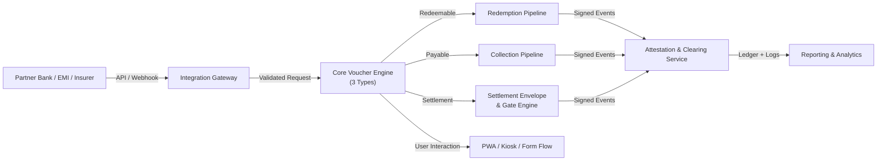
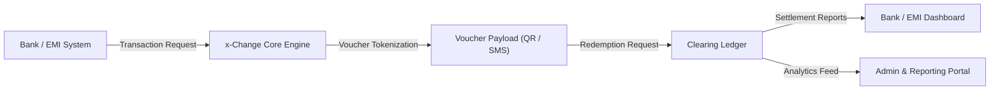
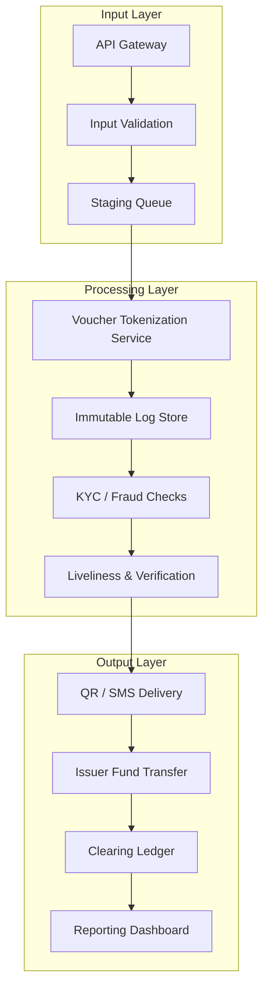
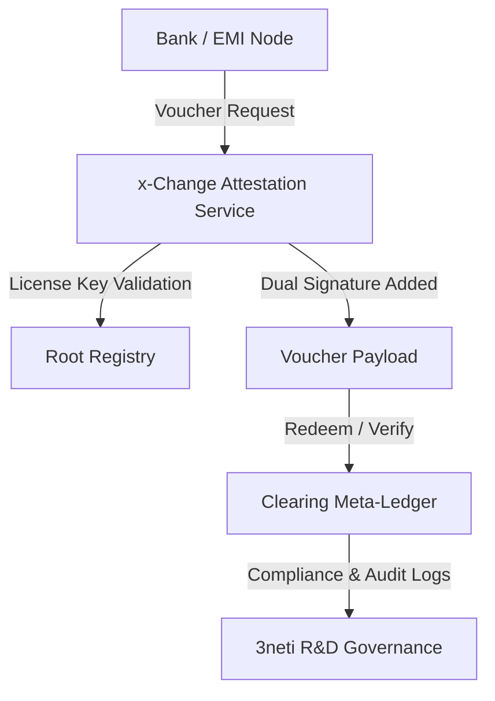

# Appendix B – Technical Architecture & Security

## **B.1 System Overview**

The **x-Change Platform** is a modular, cloud-native infrastructure for **Pay Code** — a rail-agnostic payment instruction framework supporting three transaction primitives: **redeemable** (pull-based disbursement), **payable** (presentation-based collection), and **settlement** (evidence-gated conditional execution via Settlement Envelope).  
It provides banks, EMIs, insurers, utilities, and government agencies with a secure framework for issuing, validating, routing, and auditing Pay Codes across institutions — while maintaining compliance, interoperability, and full institutional autonomy.

---

### **High-Level Architecture**



**Core Components**

- **Core Voucher Engine (Three Types)**  
  Handles creation, tokenization, signing, and lifecycle management for redeemable, payable, and settlement Pay Codes. Includes dynamic per-voucher-feature pricing engine and campaign system.

- **Settlement Envelope & Gate Engine**  
  YAML-driven evidence collection and gating system. Manages checklists (documents, payload fields, attestations), signals (boolean approvals), and computed gates. Supports composable driver inheritance and a 10-state envelope lifecycle.

- **Form Flow System**  
  Autonomous multi-step input collection powering all redemption and evidence-gathering workflows. Five handler packages: form, KYC (HyperVerge), location (GPS), selfie (camera), signature (pad).

- **Integration Gateway**  
  Connects partner systems (banks, EMIs, insurers, utilities) through secure REST/JSON endpoints with mTLS and OAuth 2.1 authentication.

- **PWA / Kiosk Interfaces**  
  YAML-configurable frontend skins for use-case-specific interfaces (PhilHealth BST, utility billing, etc.). Offline-first PWA with service worker support.

- **Admin, Analytics, and Reporting Dashboards**  
  Compliance, finance, and operational visibility — fully integrated with WorkOS identity platform for SSO, MFA, and SCIM provisioning.

---

### **Architectural Principles**

- **Federated by Design**  
  Each licensed bank or EMI can host its own voucher node while remaining part of the governed x-Change scheme via cryptographic licensing and attestation.

- **Secure & Compliant**  
  Built around field-level encryption, dual signatures, immutable logs, and PDPA/BSP/AMLC-aligned policies.

- **Scalable & Cloud-Native**  
  Microservice containers orchestrated across regional clusters with automatic scaling and failover.

- **Interoperable**  
  REST/JSON APIs and event-driven webhooks enable seamless integration with legacy core-banking and fintech systems.

- **Auditable & Observable**  
  All issuance and redemption events are hash-anchored to a clearing ledger and available for regulatory or investor audit review.

---

### **Technology Stack Categories**  *(non-confidential summary)*

| Layer | Category | Description |
|-------|-----------|-------------|
| **Application Layer** | Modular PHP microservices (Laravel) | Core voucher engine, settlement envelope package, form flow manager, payment gateway abstraction |
| **Settlement Engine** | YAML-driven driver system | Composable checklists, signals, gates; 10-state envelope lifecycle; driver inheritance |
| **API Layer** | REST / JSON + Webhooks | Standardized partner integrations with OAuth 2.1 / mTLS; Laravel Sanctum tokens |
| **Frontend Layer** | Vue 3 + TypeScript + Tailwind | PWA/kiosk interfaces with YAML-configurable skins; offline-first service worker |
| **Identity & Access** | WorkOS Platform | SSO, SCIM, MFA, and RBAC enforcement |
| **Data & Storage** | Encrypted Datastores | AES-256 at rest, TLS 1.3 in transit, immutable log chain; 50+ database tables |
| **Infrastructure** | Cloud-native Containers | Multi-AZ deployments on AWS / DigitalOcean AP-Southeast-1 |
| **Monitoring & Analytics** | SIEM + Metrics Stack | Centralized observability, compliance dashboards |

---

**Summary:**  
The x-Change architecture combines **federated issuance**, **central attestation**, **three-type voucher lifecycle management**, and **programmable settlement gating** — delivering a standards-compliant platform that banks can trust, regulators can audit, and investors can confidently back as the foundational infrastructure for Pay Code.

---

## **B.2 Data Flow Architecture**

### **Customer Journey Overview**

1. **Voucher Creation (Issuance)**
    - A participating **bank**, **EMI**, or **enterprise** initiates a *voucher issuance request* via secure API.
    - Input includes transaction amount, recipient identifier (e.g., mobile, ID, or wallet alias), and program metadata.
    - The **x-Change Core Engine** validates the request, assigns a unique token ID, and issues a digitally signed voucher payload.
    - The voucher is delivered to the recipient as a **QR code**, **SMS link**, or **embedded token**.

2. **Voucher Redemption**
    - The recipient scans or submits the voucher using the x-Change redemption interface (web or mobile).
    - The system verifies authenticity and checks liveliness (optional face match or PIN).
    - Once validated, the redemption request is routed to the issuer’s payment endpoint for final fund transfer or cash-out.
    - Confirmation is recorded on the **x-Change Clearing Ledger** for audit and analytics.

3. **Settlement and Reporting**
    - Issuers receive a daily settlement file (or API callback) summarizing successful redemptions, expiries, and breakages.
    - Data is aggregated in the reporting dashboard for **compliance**, **accounting**, and **reconciliation**.

---

### **Conceptual Data Flow Diagram (DFD Level 0)**



---

### **Detailed Process Flow (DFD Level 1)**



---

### **Data Segregation & Privacy**

- Each participating **EMI or bank** operates within an **isolated namespace**, ensuring that voucher data is logically separated even within a shared infrastructure.
- **PII** (Personally Identifiable Information) is stored using **field-level encryption** and **anonymized** in analytical datasets.
- **Encryption in transit:** TLS 1.3
- **Encryption at rest:** AES-256
- All access follows **least-privilege principles** enforced by role-based access control (RBAC).
- No cross-tenant data access is possible without explicit cryptographic authorization.

---

### **Clearing Architecture Position**

**Federated Clearing Model**

- x-Change functions as a **protocol-based clearing hub**, not a centralized fund custodian.
- Each issuer (bank or EMI) independently generates and redeems vouchers but adheres to a **shared tokenization and verification protocol** managed by the x-Change Core.
- This design enables:
    - **Interoperability** across institutions
    - **Non-repudiation** through cryptographic hashes and timestamps
    - **Auditability** via immutable clearing logs
    - **Scalability** without centralized account storage

**Analogy:**  
Similar to the **Visa/Mastercard scheme architecture**, x-Change enforces a **common rule set and secure message routing** framework—providing global traceability while allowing local control of issuance and settlement.

---

### **Federated Control Model (Permission & Governance Layer)**

x-Change balances **institutional autonomy** with **protocol-level governance** through a hybrid model:

1. **Cryptographic Licensing**
    - Each participating institution operates its own voucher engine but requires a **digital license token** issued by 3neti R&D OPC.
    - The token authenticates periodically with a root registry to verify authorization.
    - Unauthorized or expired licenses automatically disable voucher signing.

2. **Dual-Signature Verification**
    - Every voucher token carries two cryptographic signatures:
        - One from the issuing bank or EMI.
        - One from x-Change’s attestation service.
    - Redemption systems verify both signatures, ensuring provenance and compliance.

3. **Clearing Attestation Logs**
    - Participating institutions submit **signed transaction hashes** to a shared **meta-ledger**, providing cross-institution auditability.
    - This ensures traceability and compliance even when voucher issuance and redemption are hosted independently.

4. **Contractual Scheme Governance**
    - All participants operate under a **Network Participation and Brand License Agreement**.
    - 3neti R&D retains IP ownership and the right to revoke certification for non-compliance or rogue implementations.
    - Certified institutions may display the “**Powered by x-Change™**” mark.



**Summary:**  
This model maintains **independent execution** for partner banks while preserving **protocol integrity**, **license enforcement**, and **brand governance** through cryptographic attestation and scheme certification.

---

### **Commercial Relevance and Investment Rationale**

The x-Change architecture enables **licensed banks and EMIs** to operate autonomously while **3neti R&D OPC** retains control of the **core protocol, attestation service, and certification rights**.  
This structure ensures that every transaction in the network—regardless of who issues or redeems it—passes through a **governed and monetized layer** owned and licensed by x-Change.

Investors are thus participating not in a single application, but in the **infrastructure layer** that underpins programmable digital vouchers across multiple financial institutions.  
As adoption scales, recurring revenues arise from:
- **License fees** for running certified voucher nodes
- **Attestation service subscriptions** for transaction verification
- **Per-transaction certification charges** for compliance and audit logging

This federated yet permissioned model provides **both scalability and defensibility**—allowing x-Change to grow through institutional partnerships while maintaining proprietary control over the underlying tokenization technology and brand.

---

### **Technology Summary (Disclosure Level: Investor-Safe)**

- Built on a **secure, modular PHP service architecture** using **REST/JSON APIs**.
- Supports **containerized deployment** and **horizontal scaling** for partner-specific workloads.
- Avoids naming specific frameworks or libraries (e.g., Laravel, Vue) in open materials; those details are reserved for the **confidential technical annex** shared under NDA.

---

## B.3 Security Framework

### **Security Objectives**
- **Confidentiality** of PII, voucher payloads, and institutional data
- **Integrity** of voucher issuance, redemption, and clearing records
- **Availability** of issuance and redemption APIs
- **Non-repudiation** through dual-signature attestation
- **Tenant isolation** per participating bank/EMI
- **Regulatory alignment** with the Philippine Data Privacy Act and ISO 27001-equivalent controls

---

### **Control Baselines (Industry Standards)**
- **Encryption:** AES-256 for data at rest; **TLS 1.3** for data in transit
- **Access:** **WorkOS SSO** + **MFA** for all administrative and partner portals
- **Authorization:** WorkOS Directory Sync (SCIM) with **Role-Based Access Control (RBAC)** and **least privilege**
- **Key Management:** HSM/KMS-based keys, 90-day rotation, dual-custody approvals
- **Secure SDLC:** Static/dynamic scanning, signed artifacts, dependency pinning, IaC validation
- **Monitoring:** Continuous vulnerability scanning, centralized **SIEM**, and annual third-party pen tests
- **Resilience:** Multi-AZ redundancy, encrypted backups, defined RTO/RPO, DDoS protection

---

### **Integration with WorkOS Identity Platform**

| Capability | Implementation |
|-------------|----------------|
| **SSO Integration** | All x-Change admin and issuer dashboards authenticate through **WorkOS SSO**, supporting SAML 2.0 and OIDC (Okta, Azure AD, Google Workspace, etc.). |
| **Directory Sync (SCIM)** | User and group provisioning synced automatically from partner identity providers, ensuring real-time role updates and de-provisioning. |
| **MFA Enforcement** | WorkOS enforces per-tenant or global MFA policies (TOTP, push, or WebAuthn). |
| **RBAC Mapping** | Roles (e.g., *Issuer Admin*, *Compliance Officer*, *Finance Viewer*) managed centrally through WorkOS and mirrored to x-Change internal RBAC. |
| **Audit Trails** | All login, role-change, and SCIM sync events streamed to the SIEM for compliance and anomaly detection. |
| **Session Management** | JWTs with short TTLs; token introspection against WorkOS to validate session integrity and revocations. |

---

### **Controls by Architectural Layer (from B.2)**

#### **1. Input Layer (API Gateway → Validation → Queue)**
- **API Gateway**
    - TLS 1.3, WAF, rate-limiting, IP allowlists per issuer
    - OAuth 2.1 / mTLS credentials issued per issuer via WorkOS Service Accounts
- **Validation**
    - Strict schema checks, anti-injection, nonce/idempotency for replay prevention
- **Queue**
    - AES-256-encrypted topics per tenant, IAM scopes mapped to WorkOS organization IDs

#### **2. Processing Layer (Tokenization → Immutable Log → KYC/Fraud → Liveliness)**
- **Voucher Tokenization**
    - Dual signature (issuer + x-Change attestation) with license verification
    - Short-lived, single-use tokens bound to WorkOS Org ID
- **Immutable Log Store**
    - Hash-chained, append-only events; WORM storage
- **KYC/Fraud Checks**
    - Risk scoring, velocity limits, adaptive challenges (PIN/Face)
- **Liveliness**
    - PAD/anti-spoofing; anonymized result storage

#### **3. Output Layer (Delivery → Funds Transfer → Ledger → Reporting)**
- **Delivery**
    - Signed QR/SMS links; single-use; WorkOS tenant ID tagging for traceability
- **Funds Transfer**
    - mTLS; issuer-scoped credentials; signed requests with idempotency
- **Clearing Ledger**
    - Dual-signed, hash-anchored records; immutable attestation
- **Reporting Dashboard**
    - Access via WorkOS SSO; ABAC enforced by WorkOS directory groups; masked PII

---

### **Data Protection & Privacy**
- **Field-level encryption** for PII with per-tenant keyrings
- **Token payloads** carry only hashed identifiers (no raw PII)
- **Analytics data** anonymized and de-identified
- **Retention policies:** operational 90 days PII / audit 7 years hashes
- **WorkOS DPA** governs identity data handling and cross-border transfers

---

### **Network & Tenancy Isolation**
- Dedicated namespaces and IAM policies per WorkOS organization ID
- Micro-segmented VPCs; deny-by-default intra-tenant traffic
- Optional dedicated environments for high-risk issuers

---

### **Logging, Monitoring & SIEM**
- Centralized event aggregation (auth, issuance, redemption, admin)
- **WorkOS event webhooks** integrated into SIEM for identity activity visibility
- UEBA detection on unusual login or voucher activity
- Tamper-evident log storage and chain-of-custody exports

---

### **Resilience & Continuity**
- HA across multiple zones, encrypted backups with quarterly restore tests
- **RTO/RPO:** Issuance 30 min/5 min  •  Redemption 15 min/≤5 min
- Degraded mode: queued redemptions with extended TTL tokens

---

### **Software Supply Chain & SDLC**
- SBOM tracking; dependency and IaC scanning
- Signed containers; private registry with admission control
- Blue/green deployments and auto-rollback policies

---

### **Governance & Compliance**
- Policies aligned to ISO 27001 and NIST 800-53 baselines
- Annual external pen test, quarterly risk review, DPAs with issuers
- Incident response simulations and WorkOS SSO for role-based incident access

---

### **Security Controls Matrix**

| Flow Stage | Primary Risk | Control (with WorkOS Integration) |
|-------------|--------------|-----------------------------------|
| **Issuance** | Credential abuse | OAuth 2.1 + WorkOS Service Accounts, TLS 1.3, WAF |
| **Tokenization** | Forgery / Key misuse | Dual signatures, HSM/KMS rotation, Org-bound license check |
| **Delivery** | Token leakage | Signed URLs, short TTL, no PII, tenant tagging |
| **Redemption** | Account takeover | WorkOS SSO/MFA, adaptive auth, device binding |
| **Ledger** | Tampering / Repudiation | Hash-chaining, dual attestation, immutable storage |
| **Reporting** | Data leak | ABAC via WorkOS groups, PII masking, watermarked exports |
| **Admin** | Privilege misuse | WorkOS MFA + SCIM, SoD, four-eyes approvals, audit logs |

---

### **Cryptographic Licensing & Attestation**
- License tokens verified by x-Change Attestation Service; tied to WorkOS Org IDs
- Auto-revocation on expiry or misuse
- Redemption verifies both issuer and attestation signatures

---

### **Operational Cadence**
- **Daily:** SIEM triage, WorkOS event review, backup check
- **Weekly:** Patching, secrets rotation, dependency updates
- **Monthly:** Access recertification via WorkOS Directory Sync
- **Quarterly:** DR drills, policy reviews
- **Annually:** External pen test, policy re-baseline, WorkOS security attestation

---

### **Investor Note**
By integrating **WorkOS** for identity and access, x-Change achieves **enterprise-grade IAM parity** with banks and EMIs—supporting SSO, SCIM, and MFA out of the box—while retaining proprietary control over voucher tokenization, attestation, and clearing.  
Security is both a compliance enabler and a commercial differentiator: every identity and event is verifiable, every transaction auditable, and every issuer fully isolated within its own WorkOS-managed tenant.

---

## **B.4 Compliance & Certifications**

### **Regulatory Conformance**

The **x-Change Platform** is built to operate fully within the boundaries of Philippine financial and data-privacy regulations.  
It complements — rather than replaces — the compliance frameworks of its licensed banking and EMI partners.

> ⚖️ **Regulatory Note:**  
> **x-Change** is a **technology infrastructure provider**, not a financial institution.  
> We operate **under the license perimeter** of our **Electronic Money Issuer (EMI)** and **banking partners**, who hold the required BSP licenses.  
> The platform **does not custody funds** or **transmit money directly** — it powers programmable voucher issuance, redemption, and audit trails for regulated institutions.

#### **Bangko Sentral ng Pilipinas (BSP)**
- Fully aligned with BSP regulations on **digital payments** and **outsourced financial-technology services**.
- Partner EMIs and banks retain full custodial responsibility, ensuring compliance with remittance and e-money supervision standards.
- All transaction data, wallet ledgers, and voucher trails remain securely stored within BSP-registered partner environments.

#### **Anti-Money Laundering Council (AMLC)**
- End-to-end **Know-Your-Customer (KYC)** and **transaction-monitoring** workflows are integrated through partner EMIs.
- The system enforces automatic screening against **global watchlists** and generates detailed audit logs for AMLC review.
- Records are encrypted and retained for the prescribed statutory period.

#### **National Privacy Commission (NPC) – PDPA**
- Conforms to the **Data Privacy Act of 2012**, ensuring lawful, transparent, and limited data processing.
- **Privacy Impact Assessments (PIAs)** are conducted for every new module or integration.
- Data subjects can request access, correction, or deletion of their personal information through the platform’s Privacy Center.

#### **PCI DSS and Security Standards**
- Financial data is protected under **Payment Card Industry Data Security Standards (PCI DSS)** controls.
- Tokenization, AES-256 encryption, and TLS 1.3 protect sensitive data both at rest and in transit.
- Independent vulnerability scans and penetration tests are performed annually by certified third-party assessors.

---

### **Periodic Audit & Data Retention**

| Audit Type | Frequency | Scope | Responsible Entity |
|-------------|------------|--------|--------------------|
| **Internal Security Audit** | Quarterly | Access logs, configuration management, incident readiness | x-Change Information Security Team |
| **External Compliance Review** | Annual | BSP / AMLC / NPC / PCI DSS validation | Accredited Third-Party Auditor |
| **Penetration Testing** | Annual | API, infrastructure, and web applications | Certified Security Partner |
| **Data Privacy Review** | Semi-Annual | PIA updates and data-subject rights management | Data Protection Officer |

All data — transactional, biometric, or identity-linked — is retained **only as long as required** for regulatory or operational purposes, then **securely deleted or anonymized** in compliance with NPC retention standards.

---

## **B.5 Infrastructure Resilience & Disaster Recovery**

x-Change is engineered for **high availability**, **business continuity**, and **rapid recovery** in the event of infrastructure or network disruptions.

- **Primary Hosting:** Deployed on redundant **regional cloud clusters** (e.g., AWS AP-Southeast-1 and DigitalOcean SGP) with multi-AZ failover capability.
- **Uptime Objective:** **99.9 % SLA**, monitored through continuous uptime checks and synthetic transactions.
- **Recovery Objectives:**
    - **RPO (Recovery Point Objective):** 15 minutes — maximum acceptable data loss.
    - **RTO (Recovery Time Objective):** 2 hours — maximum acceptable downtime to restore operations.
- **Data Protection:**
    - Daily **off-site, encrypted backups** stored in geographically separate regions.
    - Versioned snapshot retention with 30-day lifecycle management.
    - Backups are automatically verified for integrity through checksum validation.
- **Disaster-Recovery Topology:**
    - **Warm-standby** environment maintained in a secondary region with automated failover orchestration.
    - Periodic **failover drills** and restoration simulations to validate readiness.
- **Operational Monitoring:**
    - Continuous **health checks** and alerting via centralized logging and metrics dashboards.
    - Proactive **incident response playbooks** with defined escalation paths.
- **Best Practices Alignment:**
    - Follows AWS Well-Architected Framework and NIST SP 800-34 (Contingency Planning Guide).
    - Annual **BCP/DR** (Business Continuity & Disaster Recovery) review and update cycle.

---

## **B.6 Intellectual Property Protection**

- All proprietary **source code**, **architecture**, and **infrastructure** are owned by **3neti Research & Development OPC**, protected under registered copyright and **pending patent applications** covering five core innovations:
    1. **Pay Code** — rail-agnostic payment instruction framework (method + system)
    2. **Settlement Envelope** — driver-based evidence gating system for conditional settlement
    3. **Voucher Orchestration Engine** — programmable issuance, redemption routing, and metadata schema
    4. **Driver Composition System** — YAML-based composable workflow configuration with inheritance
    5. **Form Flow System** — autonomous multi-step input collection with declarative transformation

- The implementing company, **Open Disbursement Technologies Inc. (ODTI)**, operates under an **exclusive commercial license** from 3neti R&D OPC, ensuring clear separation between **intellectual property ownership** and **market execution rights**.

- All trademarks, logos, and visual assets associated with **x-Change** are filed or pending under the Intellectual Property Office of the Philippines (IPOPHL).

- Source repositories are maintained in **private, access-controlled environments** with audit trails, encryption, and version control.

- Any deeper **technical documentation**, including architecture diagrams, API specifications, and source code excerpts, is accessible **only under non-disclosure agreement (NDA)** within a **secure dataroom** for qualified investors or partners.

- Future IP strategy includes:
    - Expansion of patent coverage to regional and international jurisdictions (ASEAN, USPTO, WIPO PCT).
    - Registration of “x-Change” as a **technology mark** and **software-as-a-service** (SaaS) brand.
    - Establishment of a **Defensive Publication** framework to preclude unauthorized replication while preserving open innovation potential for public-sector deployments.

---

# **B.7 Technology Roadmap (Non-Confidential Summary)**

This roadmap describes planned, **concept-level** enhancements (no implementation secrets or source code). Emphasis is on interoperability, security, auditability, and safe AI-driven automation for voucher lifecycle and partner integrations.

---

## Vision
Enable programmable, secure, auditable digital vouchers that can be created and redeemed by systems, humans, or trusted AIs (voice assistants, enterprise bots) inside a clearly governed perimeter — while preserving partner controls, user consent, and anti-fraud safeguards.

---

## Pillars of the roadmap
- **Open, secure APIs** for partner banks, EMIs, enterprise systems, and approved AI agents.
- **Programmable orchestration** so issuance rules, redemption constraints, and workflow actions are policy-driven.
- **AI-enabled automation** (assistant-driven issuance, smart routing, fraud detection) with human-in-the-loop and governance controls.
- **Immutable, auditable trails** (blockchain optional) to support compliance and forensic investigations.
- **Privacy & consent by design** — PII minimization, TTLs, and access controls.

---

## Planned enhancements (concept level)

### 1) API Standardization & Partner Integration
- REST + JSON and optional gRPC endpoints for low-latency partners.
- OpenAPI spec (versioned) and client SDKs for major languages (PHP, Node, Python, Java).
- mTLS + OAuth2 (client credentials + JWT assertions) for machine-to-machine auth.
- Per-partner configuration: allowed actions, max amount, expiry defaults, backed funding account, whitelisted origin (IP/Domain).
- Idempotency keys on issuance endpoints to avoid double-issuance.

**Example (conceptual) endpoint:**
```json
POST /v1/vouchers
Authorization: Bearer <JWT>
Content-Type: application/json
{
  "request_id": "uuid",
  "partner_id": "bank_abc",
  "recipient": {
    "name": "Mr. Cruz",
    "identifier": { "type":"mobile", "value":"+63917xxxxxxx" }
  },
  "amount": 2000,
  "currency": "PHP",
  "expiry": "2025-10-20T23:59:00+08:00",
  "password_protect": {
     "method":"hash",
     "hint":"birthdate" 
  },
  "meta": { "purpose":"agent_disbursement", "campaign":"jan_promo" }
}
```

### 2) AI-Driven Voucher Creation (Assistant / Agent Integration)
Enable trusted AI agents (Alexa skills, enterprise assistants, internal bots) to request voucher issuance **subject to partner policy and explicit consent**.

- **Agent model:** Agents authenticate using strong M2M credentials and are mapped to an “Agent Profile” with permitted scopes (e.g., `issue:voucher`, `preview:voucher`).
- **Voice/Assistant flow (concept):**
    1. User gives an instruction to the Assistant (e.g., “Alexa, generate a cash code for Mr. Cruz, ₱2,000, protect with birthday, expire tomorrow.”)
    2. Assistant repeats summary and requests explicit consent (voice or linked UI — *consent must be recorded*).
    3. Assistant calls x-Change `POST /v1/agents/{agent_id}/vouchers` with the user-consent token and partner context.
    4. x-Change performs policy checks (max limits, KYC requirement, funding availability), issues voucher and returns token/QR/link.
    5. Audit event written with full provenance (agent_id, user_consent_id, partner_id, time, hash).

**Assistant request example (conceptual):**
```json
POST /v1/agents/alexa_xyz/vouchers
Authorization: Bearer <Agent-JWT>
{
  "consent_id": "consent_uuid",
  "recipient": { "name":"Mr. Cruz", "identifier": { "type":"mobile", "value":"+63..." } },
  "amount": 2000,
  "expiry": "2025-10-20T23:59:00+08:00",
  "password_hint":"birthdate"
}
```

**Governance & safety controls for AI agents**
- **Whitelist** agents per partner. Default deny for unknown agents.
- **Conversation confirmation & consent capture** mandatory for voice flows; store consent artifact (audio/text) as part of audit.
- **Rate and amount limits** per agent and per end-user to prevent abuse.
- **Human verification gating** for high-value or unusual requests (OTP to recipient, admin approval workflow).
- **Template restrictions & content filters** — agents can only use pre-approved voucher templates/purposes to avoid misuse.

### 3) Programmable Workflows & Orchestration
- Declarative workflow engine enabling rules like:
    - require KYC for amounts > X
    - require OTP to recipient for remote issuance
    - auto-route to cash-out partner if recipient chooses
    - trigger webhook / callback after redemption
- Workflow actions include notifications (SMS/Email), hold/unhold, auto-expire, refund orchestration.

### 4) AI-based Fraud Detection & Risk Scoring
- Real-time models (concept only) flag suspicious patterns: velocity, device fingerprint anomalies, invalid PII patterns, agent behavior deviations.
- Risk score integrated into issuance decision; high-risk requests can be blocked or escalated.
- Model outputs recorded in audit trail (explainable features stored, not raw model weights).

### 5) Audit, Traceability & Optional Blockchain Anchoring
- Every issuance and redemption event is immutably logged with provenance metadata (actor, agent, partner, consent_id, funding_account, IP, device fingerprint).
- Optionally anchor daily commitment hashes on a public/private chain for external verifiability (module turned on per partner).
- Support for legal-grade export (signed PDF/CSV) of audit slices for compliance review.

### 6) Security, Key Management & HSM Integration
- Use HSM or cloud KMS for signing tokens, voucher signatures, and private keys.
- Signed voucher payloads (JWT or CBOR) with replay protection and short TTLs.
- mTLS between sensitive microservices and strong role-based access control (RBAC).

### 7) Privacy & Data Minimization
- Minimize PII stored on vouchers — store pointers and hashed identifiers where possible.
- TTL and automated purge for logs containing sensitive fields (subject to audit retention rules agreed with partner).
- Data residency configurable per partner (store full PII in partner’s vault if required).

### 8) Observability, Monitoring & Partner SLAs
- Per-partner dashboards: issuance volumes, redemptions, latency, fraud flags, dispute counts.
- Alerting for policy violations, funding shortfalls, or suspicious agent behavior.
- SLAs: availability, median latency targets, and incident response times defined in partner contracts.

---

## Example: Voice assistant full flow (mermaid, conceptual)


---

## Non-confidential API design highlights
- **Authentication:** OAuth2 client credentials + signed JWT for agents + optional mutual TLS.
- **Idempotency:** `Idempotency-Key` header at issuance endpoints.
- **Audit fields returned:** `voucher_id`, `request_id`, `issued_at`, `issued_by` (agent/partner id), `consent_id` (if present), `provenance_hash`.
- **Webhooks:** Partner-configurable for `voucher.issued`, `voucher.redeemed`, `voucher.expired`, signed with rotating HMAC keys.
- **Rate limits & quotas:** Per agent, partner, and global. Dynamic throttling for anomalous patterns.

---

## AI Governance & Ethics (non-confidential)
- Agents/assistant access strictly controlled and scoped.
- Explicit consent capture required for assistant-initiated money movements.
- Human-in-the-loop gating for non-routine or high risk actions.
- Explainability: store model inputs that led to a block/escalation to support downstream review.
- Regular audits of agent activity and model performance.

---

## Rollout & partner onboarding (high-level)
1. **Pilot with internal agents** (admin UI + API) and single bank partner.
2. **Partner sandbox** and developer portal with sample agents and test funds.
3. **Limited assistant integration** (approved skill/agent) — manual review and co-testing.
4. **Gradual scale up** with automated monitoring and rate caps.
5. **Optional public chain anchoring** enabled after partner legal review.

---

## Commercial & compliance considerations
- Provide partner-configurable **policy templates** (KYC thresholds, settlement timing, transaction fees).
- Clearly document **who holds funds at each stage** — x-Change acts as a technology provider; funds are custody-managed by partner EMI/bank per contract. (This language aligns with investor FAQ and regulatory note.)
- Ensure audit exports and e-discovery packages align with regulator requests.

---

## Risks and mitigations (summary)
- **Agent compromise / insider misuse** — mitigate via per-agent keys, short token TTLs, MFA on management UIs, and periodic re-keying.
- **Voice consent spoofing** — require multi-factor or linked UI confirmation for high-value issuance.
- **Model drift / false positives** — monitor model performance; keep human escalation and appeal paths.
- **Regulatory variation across jurisdictions** — make data residency and logging configurable per partner.

---

## What we are *not* revealing here
This section intentionally excludes implementation details such as model architectures, source code, private key material, or proprietary heuristics — all of which remain confidential and protected under our IP and partner NDAs.

---

> **Note:**  
> This appendix provides assurance of x-Change’s architectural soundness, scalability, and compliance posture **without disclosing proprietary source code or algorithms.**  
> Detailed technical documentation will be shared only with accredited diligence partners under a separate NDA.
