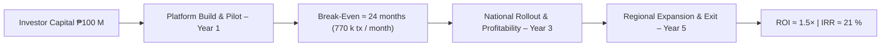

# **Appendix E – Pitch Deck Summary**
### *Condensed presentation highlights, financial snapshot, and key talking points for investor briefings*

---

## **E.1 Elevator Pitch**

**x-Change** is the orchestration platform behind **Pay Code** — a rail-agnostic payment instruction framework with three transaction primitives:

- **Redeemable** — institution disburses; recipient pulls funds into any channel
- **Payable** — payer presents code; funds flow to collector via any wallet/bank
- **Settlement** — evidence-gated conditional execution via Settlement Envelope

Pay Code is to digital payments what the URL was to the internet: a **universal addressing layer** that lets existing infrastructure do the work. We're not another wallet — we're the **scheme layer** connecting wallets, banks, insurers, and government agencies.

**Key Attributes**
- Three primitives covering disbursement, collection, and conditional settlement
- App-less for recipients (SMS + QR first-class)
- KYC/AML-compliant for issuers
- Programmable Settlement Envelope for insurance, lending, and government contracts
- Fully API-driven with YAML-configurable verticals
- Patent-pending IP across 5 invention claims

---

## **E.2 Problem & Opportunity**

| Challenge | Market Gap | x-Change Solution |
|------------|-------------|------------------|
| Disbursements require recipient bank details and real-time readiness | Millions remain unbanked or under-connected | “Pull-based” model — recipient redeems later, anywhere |
| High cost of manual or closed-loop payout systems | OTC and wallet fees ₱10–₱25 / tx | ₱5 / tx programmable voucher |
| Lack of transparency in aid & incentive programs | Weak audit trails, fraud & leakage | Immutable metadata & redemption logs |
| Limited interoperability between banks & wallets | Closed ecosystems | Account-agnostic API layer for all rails |

**Addressable Market:** ₱ 8+ trillion across disbursement (₱2.5T), collection (₱2T+), settlement (₱1.3T+), and loyalty (₱200B+) ecosystems in the Philippines.

---

## **E.3 Solution Snapshot**

1. **Institution Escrow:** Partner bank or EMI holds funds.
2. **Voucher Issuance:** Secure QR / SMS token generated with metadata rules.
3. **Distribution:** Recipient receives via SMS / print / portal — no app required.
4. **Redemption:** Recipient chooses destination channel.
5. **Audit:** All actions time-stamped and logged for compliance.

**Core Features**
- Voucher lifecycle orchestration
- Dynamic redemption routing
- Compliance tagging & analytics
- White-label portals
- Integration SDK & API gateway

---

## **E.4 Competitive Positioning**

| Category | Weakness | x-Change Advantage |
|-----------|-----------|--------------------|
| Traditional Remittance Centers | Manual, costly, non-auditable | Digital, automated, auditable |
| Bank Drafts / Checks | Slow, paper-based | Instant, programmable, digital |
| E-wallets (GCash, Maya) | Closed ecosystems | Open, account-agnostic rails |
| Gift Certs / Coupons | Static, limited use | Programmable digital vouchers |

**Moats**
- **Integration moat:** deep API embed with banks / EMIs
- **Compliance moat:** architecture built for BSP & AMLC alignment
- **Brand moat:** “Powered by x-Change” as trust mark

---

## **E.5 Business & Revenue Model**

| Stream | Basis | Illustration |
|---------|--------|--------------|
| **Transaction Fees (Redeemable)** | ₱ 5 / tx avg | Disbursement — core stream |
| **Transaction Fees (Payable)** | ₱ 4 / tx avg | Collection — utilities, gaming, transport |
| **Settlement Envelope Fees** | ₱ 10–₱ 50 / envelope | Higher-margin — insurance, lending, government |
| **Enterprise Licensing** | ₱ 0.5–1 M per year / institution | 15 partners ≈ ₱ 10 M / yr |
| **Value-Added Services** | ₱ 1–₱ 50 / event | Analytics, portals, kiosk skins |
| **Integration Projects** | ₱ 5 M avg per client | Onboarding & customization |
| **Float Yield / Breakage** | 2–3 % of voucher value | Shared with EMIs / banks |

> **Hybrid B2B model:** recurring + transactional revenues; 100 % equity-funded; no fund custody risk.

---

## **E.6 Financial Snapshot (₱ Millions)**

| Metric | Y1 | Y2 | Y3 | Y4 | Y5 |
|--------:|--:|--:|--:|--:|--:|
| **Revenue** | 8 | 53 | 97 | 154 | 231 |
| **Net Profit** | (18.5) | 4 | 22 | 48 | 83 |
| **EBITDA Margin %** | — | 16 | 33 | 43 | 49 |
| **Cash Balance EoY** | 48 | 51 | 72 | 111 | 167 |
| **Break-even Point** | — | ≈ Month 24 |  — |  — |  — |
| **IRR (5 yr)** | ≈ 21 % |   |   |   |   |
| **Avg ROIC** |   |   | 31 % |   |   |

**Break-even Volume:** ≈ 770 k transactions / month (₱ 46 M annual revenue).  
**Payback Period:** ≈ 3.2 years; ROI ≈ 153 % over 5 years.

---

## **E.7 Funding & Capitalization Snapshot (Post-Money, Series A)**

| Holder | Class | % Ownership | Consideration | Notes |
|---------|-------|-------------:|--------------:|------|
| **Investor Group** | Common (Series A)** | **60 %** | ₱ 100 M cash | 2 board seats + info rights |
| **3neti R&D OPC** | Common (Founder/Promoter)** | **30 %** | IP contribution | Exclusive license & tech transfer |
|| **Guido Delgado** | Common (Founding)** | **10 %** | Founding equity | Chairman & CEO || **Total** | — | **100 %** | ₱ 100 M | 100 % primary issuance – no debt |

---

## **E.8 Investment Highlights**

- **Fully-funded to profitability** – ₱ 100 M covers 24 months of operations.
- **Debt-free capitalization** ensures clean balance sheet.
- **Break-even in Year 2**, > 40 % EBITDA margin by Year 4.
- **Attractive IRR 21 %** and **payback < 3.5 yrs**.
- **Scalable to ASEAN markets** under similar regulatory regimes.
- **Exit multiple 8–11× EBITDA** (₱ 0.9–₱ 1.1 B valuation target Year 5).

---

## **E.9 Talking Points for Investor Briefings**

1. **Market Validation:** ₱ 8T+ addressable market across disbursement, collection, and settlement.
2. **Three Primitives, One Platform:** Redeemable + Payable + Settlement covers the complete transaction surface.
3. **Defensible IP:** 5 patent-pending inventions including Settlement Envelope and driver composition.
4. **Revenue Multiplier:** Three voucher types multiply revenue surfaces beyond disbursement alone.
5. **Regulatory Alignment:** BSP VAS compliant; Pay Code is instruction reference layer, not financial custodian.
6. **Impact + Profit:** bridges financial inclusion and auditability for public funds.
7. **ESG Fit:** supports UN SDG 9 and 16 through digital infrastructure and transparency.
8. **Exit Path:** Strategic acquisition or Series B liquidity within 5 years.

---

## **E.10 Visual Flow (Investor Pitch Summary)**

