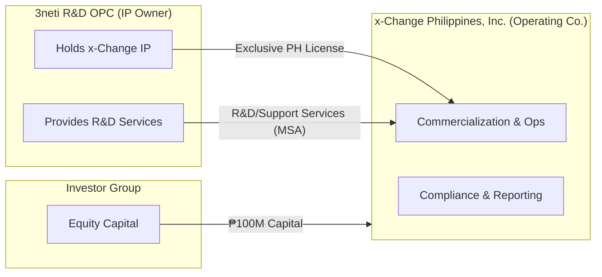
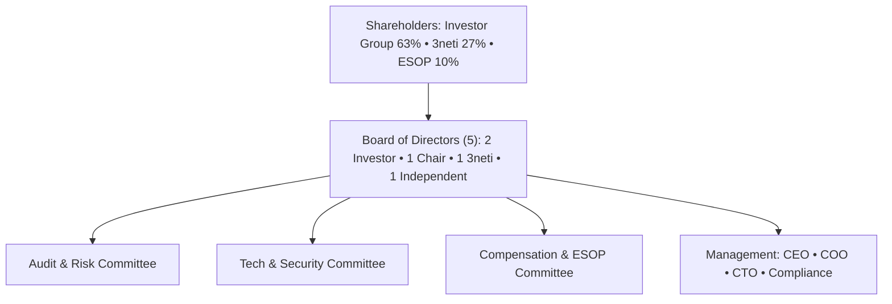

# **Appendix G – Corporate & Legal Structure**
*Shareholding distribution, governance, and licensing framework between 3neti R&D OPC and x-Change Philippines, Inc.*

---

## G.1 Overview
This appendix describes the **ownership**, **governance**, and **contractual relationships** among the parties involved in the commercialization of the **x-Change** platform in the Philippines. It is designed for investor due-diligence and board approval, and aligns with the capital structure and governance model presented in the Information Memorandum (IM).

---

## G.2 Ownership & Capitalization

### G.2.1 Capitalization Snapshot (Post-Money, Series A)
| Holder | Class | % Ownership | Consideration | Notes |
|---|---|---:|---:|---|
| **Investor Group** | Common (Series A) | **63.00 %** | **₱100,000,000** | Cash subscription; two board seats; information & inspection rights |
| **3neti R&D OPC** | Common (Founder / Promoter) | **27.00 %** | **IP contribution (carried equity)** | Exclusive license & tech contribution per §G.5; 1 board seat |
| **Employee Incentive Pool (ESOP)** | Option / Phantom Units | **10.00 % (unissued pool)** | — | Board-approved post-money pool for key personnel (e.g., Mr. Delgado, CTO, Compliance Head) |
| **Total Authorized Capital** | — | **100 %** | **₱100,000,000** | 100% primary issuance; no debt instruments outstanding |

> **Employee Incentive Pool (ESOP):**  
> The Board and Shareholders authorize a pool of up to **10 % of fully-diluted shares** to attract and retain key management and technical leaders.  
> Individual grants (e.g., 3–4 % for Mr. Delgado, 1–1.5 % for CTO, etc.) will vest over four years with a one-year cliff and Board-approved performance accelerators.  
> Unissued options revert automatically to the pool.  
> Any increase beyond 10 % requires approval under **Reserved Matters (§G.4.3)**.

---

### G.2.2 Waterfall / Priority (Non-participating, no prefs)
Unless subsequently amended, the capitalization is **straight common equity** with **no liquidation preference** or anti-dilution. Any future preferred terms require approval of **Reserved Matters** (see §G.4.3).

### G.2.3 Founders’/Key Person Lock-ups
- **3neti R&D OPC** (and its beneficial owners) agree to a **36-month lock-up** on share transfers, subject to customary exceptions (intra-group transfers, estate planning, or investor-approved secondary).
- Management ESOP grants, if any, carry **4-year vesting with 1-year cliff**.

---

## G.3 Structure & Diagrams

### G.3.1 Legal Structure (Philippines)

### G.3.2 Governance Diagram

---

## G.4 Governance Framework

### G.4.1 Board Composition & Meetings
- **Five (5) directors:** two investor nominees, one chair (investor-aligned or independent), one 3neti nominee, one independent.
- **Quorum:** 3 directors, including at least **one investor nominee** and **either the chair or independent**.
- **Voting:** Simple majority of directors present, except **Reserved Matters**.
- **Frequency:** At least **quarterly**; special sessions for material contracts or financings.

### G.4.2 Information Rights & Audit
- **Quarterly** management accounts; **annual** audited FS by an investor-approved auditor.
- **KPI dashboard** access (security, uptime, transactions, compliance tickets).
- Right to **inspect books and records** upon reasonable notice.

### G.4.3 Reserved Matters (Supermajority / Veto)
Actions requiring **(a) Board supermajority (≥4/5)** and **(b) Shareholder consent** including **at least one investor affirmative vote**:
1. Issuance of new shares or securities, or changes to rights/classes.
2. M&A, sale of all/substantially all assets, JV of core business.
3. Incurrence of debt above **₱10M** or outside approved budget.
4. Changes to business scope, budget deviations > **20%**, or off-budget CapEx > **₱5M**.
5. Related-party transactions > **₱2M** per annum.
6. Amendment of AoI/By-Laws, liquidation, buybacks, or dividends.
7. Grant/transfer/encumbrance of **core IP** or **license rights** outside §G.5.
8. ESOP pool creation/expansion or grants > **1%** to any single individual.
9. Appointment/removal of CEO, CFO, or CTO.

### G.4.4 Share Transfer Regime
- **ROFR/Tag/Drag:** Standard **Right of First Refusal**, **Tag-Along** for minority, and **Drag-Along** on sale approved under Reserved Matters.
- **Permitted Transfers:** Intra-group with **lock-up** and **joinder** to Shareholders’ Agreement (SHA).

### G.4.5 Dividend Policy
- No dividends before **Y3**, unless approved under Reserved Matters and not impairing regulatory or cash-buffer thresholds.

---

## G.5 Licensing & Services Framework (3neti → Operating Co.)

### G.5.1 Exclusive Territory License (Philippines)
- **Licensor:** 3neti R&D OPC
- **Licensee:** x-Change Philippines, Inc.
- **Scope:** Exclusive commercialization and use of **x-Change** platform **within the Philippines**.
- **Field of Use:** Programmable vouchers, disbursements, settlement tooling, analytics modules.
- **Term:** **10 years**, **renewable** (mutual option) with performance KPIs.
- **Consideration:** **Carried equity (27%)** in lieu of recurring royalties for baseline modules.
- **Upgrades:** New major modules may be licensed via addenda (see §G.5.4).
- **Sublicensing:** Permitted to banks/EMIs/enterprises **for use only** (no source code), under standard partner MSAs; **no transfer** of IP ownership.

### G.5.2 IP Ownership & Improvements
- **Background IP:** Remains with **3neti**.
- **Foreground IP (PH-specific configurations, connectors, templates):** Owned by **Operating Co.**, but **licensed back** to 3neti on a **worldwide, royalty-free, non-exclusive** basis for reuse outside the Philippines.
- **Patent/Trademark Filings:** Held by **3neti**; Operating Co. has **exclusive PH usage** and right to enforce within territory.

### G.5.3 Support & R&D Services (Master Services Agreement – MSA)
- **Services:** Roadmap, security updates, incident response, performance tuning, partner integrations.
- **SLA Targets:** Uptime **99.9%**, **RPO 15 min**, **RTO 2 hrs** (aligned with IM).
- **Fees:** **Budgeted, cost-plus** or **fixed-fee** statements of work (SOW) approved annually by the Board.
- **Change Control:** All material changes via **Tech & Security Committee**.
- **Data Handling:** No production PII is stored or processed by 3neti outside approved environments and DPAs.

### G.5.4 New Modules & Major Versions
- **Baseline Modules:** Voucher engine, redemption pipeline, policy/risk, reporting. Included under carried-equity consideration.
- **Premium Modules (optional):** AI voice flows, branded landing pages, advanced analytics, third-party connectors. Licensed via separate addenda with **board-approved pricing** (e.g., capped royalty %, or one-time license).

### G.5.5 License Termination & Step-In
- **For Cause:** Insolvency, material breach, or security incidents not cured within defined periods.
- **Transition Assistance:** 3neti provides escrowed deployment artifacts and documentation to ensure **continuity of operations**.
- **Source Code Escrow:** Deposited with a neutral agent; **release triggers** tied to termination events for operating continuity.

---

## G.6 Contract Register (Primary Documents)
1. **Shareholders’ Agreement (SHA)** – capitalization, transfer regime, Reserved Matters, information rights.
2. **Intellectual Property License Agreement** – per §G.5 (territory, scope, term, improvements).
3. **Master Services Agreement (MSA)** – R&D, support, SLAs, security, change control.
4. **Data Processing Agreement (DPA)** – PDPA compliance, cross-border transfers, sub-processors.
5. **Partner/Customer MSA** – banks, EMIs, enterprises; includes standard **SLA** and **security annex**.
6. **Open Finance & Compliance Annex** – AML/CFT, audit, logging, data retention.
7. **Employment & ESOP Plan Docs** – offer letters, IP/Confidentiality assignment, vesting schedules.
8. **Policies** – Information Security, Incident Response, Vendor Management, Business Continuity.

---

## G.7 Regulatory & Compliance Notes
- **License Perimeter:** x-Change PH is a **technology infrastructure provider**, operating **under partner EMI/bank license umbrellas**; the company **does not custody funds**.
- **Data Privacy:** Compliance with **Philippine Data Privacy Act (PDPA)**; DPA in place with processors; breach-notification workflows.
- **Audit & Logs:** Centralized logging (SIEM), annual third-party penetration tests, and regulator-ready reports.
- **Open Finance Alignment:** Connector strategy consistent with BSP frameworks and partner banks’ API policies.

---

## G.8 Risk, Controls & Mitigants (Corporate)
| Risk | Control / Mitigant |
|---|---|
| Key-person or vendor dependency | Source-code escrow; dual-vendor options; internal capability build in PH |
| Related-party risk (R&D) | Board-approved MSAs/SOWs; independent pricing review; audit rights |
| License revocation or lapse | KPI-linked renewals; cure periods; step-in & transition assistance |
| IP leakage at partners | No-source distribution; strong MSAs; watermarking & tamper-proof builds |
| Governance drift | Reserved Matters; independent director; committee charters |
| Regulatory scope creep | Legal review of new products; perimeter statement in all MSAs |

---

## G.9 Signature Blocks (Template Snippets)

> **Shareholders’ Agreement – Joinder**  
> “The Undersigned hereby agrees to be bound by the Shareholders’ Agreement dated ____, as may be amended, and to be treated as a Shareholder thereunder for all purposes.”

> **License Back (Improvements)**  
> “Operating Co. grants Licensor a worldwide, royalty-free, non-exclusive license to Foreground IP developed by or for Operating Co., solely to exploit outside the Territory.”

> **R&D MSA – Security**  
> “Vendor shall comply with ISO 27001-aligned controls and meet SLA targets of 99.9% uptime, RPO 15 minutes, and RTO 2 hours; material incidents reported within 24 hours.”

---

### G.10 Appendices (Optional)
- **G.10.1 Reserved Matters Matrix** (Board vs. Shareholder thresholds)
- **G.10.2 ESOP Term Sheet** (pool size, vesting, acceleration)
- **G.10.3 Source-Code Escrow Agreement** (agent, deposit cadence, release conditions)
- **G.10.4 Committee Charters** (Audit/Risk, Tech/Sec, Compensation)
