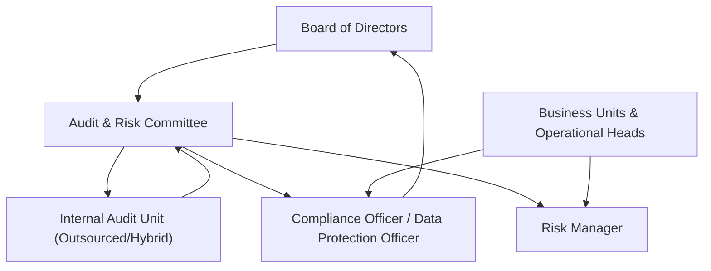

# **Appendix J – Audit & Monitoring Framework**
*Internal control, compliance, and assurance structure for x-Change Philippines, Inc.*

---

## J.1 Purpose & Scope
This framework establishes how **x-Change Philippines, Inc.** ensures continuous oversight, transparency, and regulatory compliance across all operations.  
It defines the audit architecture, control layers, and information-flow mechanisms between management, the Board, and regulators.  
The objective is to demonstrate a **“trust-by-design”** environment aligned with BSP, AMLC, and PDPA requirements.

---

## J.2 Three Lines of Defense Model

| Line | Responsibility | Key Functions | Reporting To |
|------|----------------|---------------|--------------|
| **1. Operational Management** | Own and manage risks | Process controls, maker-checker authorization, incident reporting | Functional Heads |
| **2. Risk & Compliance Functions** | Oversight and monitoring | KPI/KRI tracking, compliance testing, DPO and AML officer reviews | Audit & Risk Committee |
| **3. Internal Audit (Independent)** | Assurance and validation | Risk-based audits, control testing, follow-up actions | Board of Directors (Audit Committee) |

---

## J.3 Audit Governance Structure

**Key Policies:** Audit Charter | Risk Management Policy | Whistleblower Policy | Data Privacy Policy

---

## J.4 Internal Audit Function

| Aspect | Description |
|--------|--------------|
| **Mandate** | Provide independent and objective assurance on the effectiveness of internal controls, risk management, and governance. |
| **Coverage** | Financial controls, IT security, PDPA compliance, vendor management, and business continuity. |
| **Frequency** | Comprehensive audit annually; thematic audits quarterly (e.g., Cyber Resilience, KYC). |
| **Standards** | Aligned with **IIA International Standards** and **ISO 19011 Audit Guidelines**. |
| **Reporting** | Findings classified as Critical, Major, or Minor with corrective-action plans tracked to closure. |

---

## J.5 Compliance Monitoring

| Domain | Monitoring Mechanism | Frequency | Owner |
|--------|----------------------|-----------|-------|
| **Regulatory Filings** | BSP and AMLC report submission checklist | Monthly | Compliance Officer |
| **Data Privacy (PDPA)** | Quarterly privacy impact assessments (DPIA) | Quarterly | DPO |
| **Information Security** | Vulnerability scans, penetration testing | Semi-annual | CTO / Security Team |
| **Business Continuity** | BCP drills and disaster recovery tests | Semi-annual | COO |
| **AML / Transaction Monitoring** | Automated red-flag alert reviews | Daily | Compliance & Partner EMI |
| **Financial Controls** | Reconciliation of float and vouchers | Daily | Finance Department |

---

## J.6 External Audit & Assurance

| Type | Scope | Frequency | Auditor / Authority |
|------|--------|-----------|--------------------|
| **Financial Audit** | IFRS-compliant FS | Annual | Investor-approved CPA firm |
| **Regulatory Compliance Audit** | BSP/AMLC requirements | Annual | External Compliance Auditor |
| **Cybersecurity Audit** | Penetration and vulnerability testing | Annual | Accredited Cyber Security Vendor |
| **Data Privacy Audit** | PDPA compliance | Biennial | NPC-registered Privacy Auditor |

Results are reported to the Audit & Risk Committee and shared with investors upon request.

---

## J.7 Continuous Monitoring & Technology Controls

- **Centralized Dashboard:** Aggregates logs from AWS CloudWatch, application metrics, and security alerts (SIEM).
- **Automated Alerts:** Threshold breach notifications for RPO/RTO, CPU load, and transaction errors.
- **Exception Reporting:** Daily review of anomalies in voucher issuance and redemption.
- **Access Reviews:** Quarterly revalidation of user roles under RBAC model.
- **Audit Trail Integrity:** Immutable log storage with hash-chain verification for regulator inspection.

---

## J.8 Reporting and Escalation Protocol

| Level | Trigger Event | Report To | Response Time |
|--------|---------------|-----------|----------------|
| **Operational** | Control breach / incident | Line Manager | Within 24 hours |
| **Compliance** | Regulatory violation / AML flag | Compliance Officer + CEO | Immediate |
| **Board** | Material findings or High-risk event | Audit & Risk Committee | Within 48 hours |
| **Regulators** | Notifiable breach (PDPA/BSP) | National Privacy Commission / BSP | Per statutory requirement |

---

## J.9 Performance Metrics (Key Risk Indicators – KRIs)

| KRI Category | Indicator | Target / Threshold |
|---------------|------------|------------------|
| **System Uptime** | % availability | ≥ 99.9 % |
| **Incident Response** | Mean time to resolution (MTTR) | < 2 hours |
| **Regulatory Findings** | # of repeat non-conformities | 0 |
| **Data Privacy** | # of reportable breaches | 0 |
| **Audit Closure** | % of actions closed within timeline | ≥ 95 % |
| **Employee Training** | % of staff trained on compliance | 100 % |

---

## J.10 Integration with Corporate Governance

- **Appendix G:** Defines oversight through Audit & Risk Committee.
- **Appendix H:** Links key person performance and bonus to audit findings closure.
- **Appendix I:** Provides risk input for annual audit planning.
- **Appendix B.5:** Feeds into Disaster Recovery testing and uptime validation.

---

## J.11 Continuous Improvement & External Alignment

- Annual review of the Audit Charter to reflect best practices (ISO 31000, COSO ERM).
- Incorporate AI-based anomaly detection for transaction monitoring.
- Benchmark audit results against fintech peers and regulator feedback.
- Expand Environmental, Social, and Governance (ESG) metrics in audit scope by Year 3.

---

### J.12 Closing Statement

> “Transparency, accountability, and traceability are core to the x-Change ethos.  
> The Audit & Monitoring Framework ensures that governance is not a checklist but a living discipline—integrated into every transaction, every control, and every decision.”
