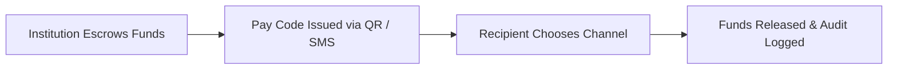
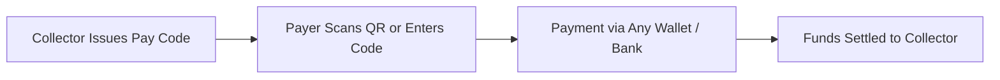
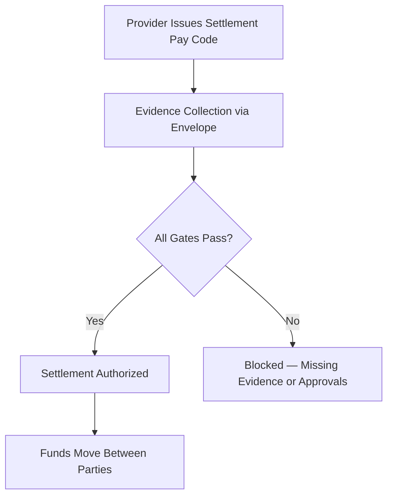

# **Pay Code: A Rail-Agnostic Payment Instruction Framework**

### *White Paper – Version 2.0*
**Prepared by 3neti Research & Development OPC**

---

## Executive Summary

Every year, trillions of pesos move through the Philippine financial system — disbursements, collections, settlements — across dozens of incompatible rails. Each rail couples **value**, **interface**, and **execution** into a single instrument: a card, a wallet, a check. The result is fragmentation. Institutions build redundant infrastructure. Recipients are locked into ecosystems they didn't choose. And the 26 million Filipinos who remain underbanked are simply excluded.

**Pay Code** eliminates this coupling.

A Pay Code is a **bearer alphanumeric reference** — not money, not a wallet, not a payment method — that resolves, validates, and executes a transaction over the issuer's existing regulated rails. It is to digital payments what the URL was to the internet: a universal addressing layer that lets the underlying infrastructure do the work.

**x-Change** is the orchestration platform that issues, validates, routes, and audits Pay Codes across institutions. It operates **under** the regulatory perimeter of licensed banks and EMIs — never holding funds, never transmitting money, never requiring its own license.

The platform supports three transaction primitives:

- **Redeemable** — institution disburses; recipient pulls funds into any channel
- **Payable** — payer presents code; funds move to collector
- **Settlement** — structured evidence and approvals gate the release of funds between parties

These three primitives cover **disbursement, collection, and conditional settlement** — the complete transaction surface for any financial institution.

---

## The Problem

### Fragmented Rails, Coupled Instruments

Today's payment instruments bind three things together:

1. **Value** — the money
2. **Interface** — the card, app, or paper
3. **Rail** — Visa, InstaPay, PesoNet, OTC

This tight coupling means:
- A GCash user can't easily receive from a BDO payroll system without both sides integrating
- A government agency disbursing aid must collect bank details from millions of beneficiaries — most of whom change wallets, lose access, or have none
- An insurer reimbursing a hospital has no way to confirm the patient actually received care
- A utility collecting payments must integrate with every wallet individually

Each use case rebuilds the same infrastructure from scratch.

### The Check Is Dead. The Concept Isn't.

Checks and demand drafts solved a real problem: **bearer-presentable payment instructions** that worked without real-time connectivity between sender and receiver. They were killed by fraud, paper handling, and slow clearing.

But the underlying concept — *an instruction reference that triggers execution upon presentation* — remains powerful. Pay Code is its digital successor: bearer-presentable, cryptographically secure, and executed over modern rails in real time.

---

## The Solution: Three Transaction Primitives

### 1. Redeemable — Pull-Based Disbursement

The institution escrows funds and issues a Pay Code. The recipient **chooses** when, where, and how to claim the money — bank, wallet, or cash-out agent.



**No app required. No account details collected upfront. Recipient decides.**

Use cases: government aid (ayuda), wages, tips, micro-loan release, OFW remittances, disaster relief, corporate rebates.

### 2. Payable — Presentation-Based Collection

A Pay Code represents a payable obligation. The payer presents the code and pays through any supported channel. Funds flow to the collector.



**One code, every wallet. No per-channel integration.**

Use cases: utility billing, loan repayment, gaming cash-in/cash-out, public transport fares, biller collections.

### 3. Settlement — Gate-Controlled Conditional Execution

A Settlement Pay Code is bound to a **Settlement Envelope** — a structured evidence container that enforces prerequisites before funds can move. The envelope may require document uploads, identity verification, authorization signals, and computed gate conditions to all pass before settlement is permitted.

Settlement vouchers may be **zero-denominated** (insurance claims — the beneficiary acknowledges service but receives no cash; money flows between institutions) or **positive-denominated** (micro-finance loans, contractor payments — funds released to the recipient only after all conditions are met).



**The defining characteristic is the Settlement Envelope, not the denomination.**

Use cases: PhilHealth claims, HMO reimbursement, motor insurance, home loan takeouts, government contractor payments, field work validation.

---

## The Settlement Envelope

The Settlement Envelope is the highest-value architectural innovation in the platform. It transforms a simple payment reference into a **programmable, evidence-gated settlement instrument**.

### How It Works

Each Settlement Pay Code is bound to an envelope configured by a **YAML driver** — a declarative specification of what evidence must be collected and what conditions must be satisfied before settlement.

A driver defines:

- **Checklist** — required documents (IDs, contracts, invoices), payload fields (names, amounts, references), and attestations
- **Signals** — boolean approvals from external systems (KYC passed, credit approved) or human reviewers (underwriting approved, final authorization)
- **Gates** — computed boolean conditions that combine checklist status, signal values, and other gates into a single `settleable` determination

### State Machine

```
DRAFT → IN_PROGRESS → READY_FOR_REVIEW → READY_TO_SETTLE → LOCKED → SETTLED
                                                              ↕
                                                           REOPENED
```

Terminal states: SETTLED, CANCELLED, REJECTED.

### Composable Drivers

Drivers support **inheritance via `extends`**. A base driver defines common requirements; overlay drivers add context-specific items.

Example: A married OFW buying a pre-selling property composes four drivers:

```
bank.home-loan.base           → 12 docs, 4 signals, 6 gates
  + eligible.married          → +2 docs, +1 signal
  + income.ofw                → +3 docs, +1 signal, +1 gate
  + property.non-rfo          → +2 docs, +1 signal, +1 gate
= 19 documents, 7 signals, 9 gates — assembled declaratively
```

No code changes. New verticals are launched by writing YAML.

---

## Architecture

### Layered Design

| Layer | Function | Owner |
|-------|----------|-------|
| **Pay Code** | Instruction reference | x-Change |
| **x-Change Platform** | Orchestration, validation, routing, audit | x-Change |
| **Banks / EMIs** | Execution, fund custody, KYC/AML | Licensed institutions |
| **Rails** | InstaPay, PesoNet, OTC, internal transfers | Existing infrastructure |

This separation ensures:
- **No custody by x-Change** — funds remain with licensed institutions
- **No new settlement system** — transactions execute over existing rails
- **Institutional control preserved** — issuers generate, honor, and execute Pay Codes
- **Full auditability** — every event is hash-anchored and compliance-ready

### Technology Stack

| Component | Technology |
|-----------|-----------|
| Core Engine | Modular PHP microservices (Laravel) |
| Frontend | Vue 3 + TypeScript + Tailwind (SPA/PWA) |
| API | REST/JSON + Webhooks, OAuth 2.1 / mTLS |
| Identity | WorkOS (SSO, SCIM, MFA, RBAC) |
| Encryption | AES-256 at rest, TLS 1.3 in transit |
| Infrastructure | Cloud-native containers, multi-AZ (AWS / DigitalOcean) |
| Settlement Drivers | YAML-configured, composable, version-controlled |

### Federation Model

Each participating bank or EMI operates within the x-Change **scheme** — a governed protocol with:

1. **Cryptographic licensing** — per-institution digital license tokens validated against a root registry
2. **Dual-signature verification** — every voucher carries signatures from both the issuing institution and x-Change's attestation service
3. **Clearing attestation logs** — signed transaction hashes submitted to a shared meta-ledger for cross-institution auditability
4. **Namespace isolation** — logical data separation with cryptographic cross-tenant protection

This is analogous to a card scheme (Visa, Mastercard): x-Change enforces rules and message routing while institutions retain local control of issuance and settlement.

---

## Pay Code vs. Existing Instruments

| Attribute | Checks / Drafts | E-Wallets | Bank Transfers | Pay Code |
|-----------|----------------|-----------|----------------|----------|
| Nature | Paper instruction | Closed ecosystem | Push-based | Digital bearer instruction |
| Value embedded | Pre-funded | Stored value | Direct debit | None — resolved at execution |
| Custody | Implicit | Wallet provider | Bank | None — issuer retains |
| Settlement | Bank clearing | Internal | Rail-specific | Issuer's existing rails |
| Interoperability | Low | Low | Medium | High — rail-agnostic |
| Fraud surface | High | Medium | Low | Low — cryptographic, auditable |
| Recipient flexibility | Low | None | None | Full — any channel |
| Programmability | None | Limited | None | Full — rules, expiry, gates, evidence |

---

## Regulatory Positioning

Pay Code does not create stored value, does not pool funds, and does not perform settlement. It functions solely as an instruction reference layer.

| Aspect | Responsibility |
|--------|---------------|
| Fund custody | Partner bank or EMI |
| KYC / AML | Redemption partner and issuing institution |
| Audit trail | x-Change technology |
| Licensing | EMI or banking partner |
| Data storage | Cloud-based with local compliance options |

From a regulatory lens, Pay Code is closer to **biller reference numbers** and **transaction instruction identifiers** than to money instruments or alternative settlement networks.

x-Change operates within the BSP framework — offering banks and EMIs a new **channel**, not a new license.

---

## Why This Matters

The Philippine payments ecosystem doesn't need another wallet. It needs **infrastructure that connects the wallets, banks, and institutions that already exist** — with programmable rules, full auditability, and zero lock-in.

Pay Code provides this. Three primitives — **redeemable, payable, settlement** — cover the entire transaction surface. The Settlement Envelope turns simple payment references into programmable, evidence-gated instruments that can handle insurance claims, home loans, and government contracts with the same architecture that handles a ₱100 tip.

This is not incremental. It's a new layer.

---

## Contact

**3neti Research & Development OPC**
Makati City, Philippines
📧 info@3neti.ph
🌐 https://x-change.ph

---

*This document is strictly confidential and intended for potential investors and strategic partners evaluating the x-Change opportunity. Unauthorized reproduction or distribution is prohibited.*
