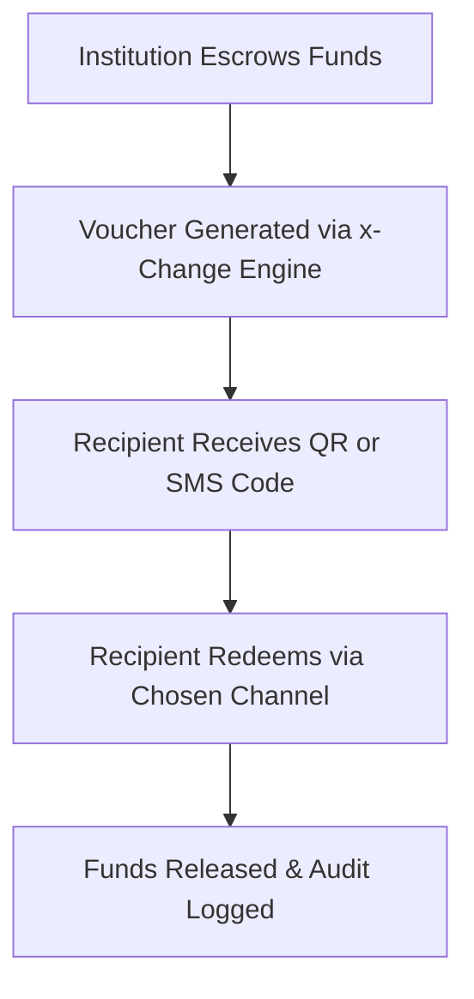

# **x-Change: Programmable, Account-Agnostic Digital Cash**

### *White Paper – Version 1.0*
**Prepared by 3neti Research & Development OPC**

---

## 🧭 Executive Summary

**x-Change** is a programmable digital voucher platform that transforms how institutions disburse money — by letting **recipients** decide *where, when, and how* they redeem funds.

Instead of pushing funds to a pre-defined bank or wallet account, x-Change **escrows the money and issues a QR- or SMS-based voucher code**. The recipient then “pulls” the funds into their chosen destination — a bank, e-wallet, or over-the-counter cash agent — on their own terms.

This *pull-based* model introduces **programmable, account-agnostic digital cash**, creating a new class of disbursement technology that’s:

- ✅ **App-less for recipients**
- ✅ **KYC/AML-compliant for issuers**
- ✅ **Secure, traceable, and auditable by design**

x-Change empowers financial institutions, money changers, NGOs, and government agencies to disburse funds instantly — without the friction of collecting account details or maintaining proprietary apps.

---

## 💡 Problem Statement

### 1. Disbursement Friction
Traditional fund transfers assume the sender already knows:
- The recipient’s exact bank or wallet account
- That the account is active and ready
- That a digital channel is accessible

In reality, these assumptions often fail, especially in **cash-first**, **low-tech**, or **offline** contexts.

### 2. App Fatigue
Many financial service providers force users into closed ecosystems. Each app, wallet, or banking platform fragments the user experience — leaving unbanked and underbanked segments excluded.

### 3. Traceability vs Flexibility
Cash is flexible but opaque. Bank transfers are traceable but restrictive. Institutions have long lacked a **middle ground** — until now.

---

## 🔄 Solution Overview

### **x-Change** bridges the gap.

We **decouple disbursement from redemption**, allowing institutions to:
1. Deposit or escrow funds into a controlled account
2. Issue **programmable digital vouchers** (QR, SMS, printed)
3. Let recipients **redeem those vouchers** at any supported payout channel

Funds remain within licensed financial institutions. x-Change provides the **infrastructure layer** — not custody.

---

## ⚙️ How It Works

### Lifecycle

1. **Escrow:** Issuer deposits funds into a controlled wallet.
2. **Issuance:** x-Change generates a voucher code linked to the escrow.
3. **Distribution:** Recipient receives code via QR, SMS, or printed form.
4. **Redemption:** Recipient chooses destination and authenticates.
5. **Settlement:** Funds move from escrow to recipient destination.
6. **Audit:** All events are logged for compliance and reconciliation.

---

## 🏦 Use Cases

| Sector | Example Application |
|--------|---------------------|
| **Financial Institutions** | OTC remittance, microloan release, unbanked payouts |
| **Government / LGUs** | Social welfare & disaster aid distribution |
| **Corporate / Payroll** | Wage advance, tip distribution, rebates |
| **NGOs / Aid Programs** | Conditional cash transfers with programmable limits |
| **E-commerce & Retail** | Digital gift cards and refund vouchers |
| **Money Changers / FX Agents** | Digital counterpart for physical cash exchange |

---

## 🔒 Compliance Architecture

x-Change operates **under the regulatory perimeter** of licensed **Electronic Money Issuers (EMIs)** and **banks**.  
We **do not**:
- Custody funds
- Transmit money directly
- Represent ourselves as a financial institution

We **do**:
- Provide APIs, issuance engines, and redemption portals
- Enforce traceability, expiry, and redemption rules
- Integrate seamlessly with regulated rails (Instapay, PesoNet, OTC networks)

### AML / CFT Compliance

KYC and AML are enforced **at redemption**:
- Verification is required before fund release
- Transaction logs are stored for audit
- Metadata includes timestamps, origin institution, and redemption details

This ensures **traceable compliance without friction** at the issuance stage.

---

## 🧩 Product Architecture

### Core Components
| Layer | Description |
|--------|-------------|
| **Voucher Engine** | Generates unique, tamper-proof voucher tokens |
| **Escrow Ledger** | Tracks and reconciles fund availability |
| **Redemption Portal** | Recipient-facing web/app interface for claiming funds |
| **Integration Layer** | Connects EMIs, banks, and payout partners |
| **Compliance Suite** | Logs, expiry enforcement, and identity verification |
| **Programmability Layer** | Allows issuers to define rules (expiry, geo-lock, channel filters) |

---

## 💰 Business Model

x-Change’s revenue streams:

1. **Enterprise Licensing**  
   Annual license for institutions using x-Change APIs and portals.  
   *Example:* ₱500,000 per bank per year.

2. **Per-Transaction Margin**  
   Shared margin (₱5 average) from each voucher redemption.

3. **Programmability Add-ons**  
   Optional feature-based pricing (₱1 per rule or ₱50 for branded landing pages).

4. **Integration Projects**  
   One-time implementation or white-label fees.  
   *Example:* ₱5 million per integration; outsourced at ₱2.5 million cost.

This blended model balances **recurring revenue** with **scalable transaction growth**.

---

## 📈 Financial Projection Summary

| Year | Milestone | Est. Monthly Transactions | Net Revenue (₱) |
|------|------------|---------------------------|------------------|
| **Year 1** | Platform readiness & pilot | 50,000 | 3M |
| **Year 2** | Institutional onboarding | 250,000 | 12M |
| **Year 3** | Nationwide scale | 500,000+ | 30M |

Assumptions:
- Average ₱5 net per disbursement
- Controlled burn in Year 1
- Integration/licensing ramp-up in Year 2
- Profitability achieved in Year 3

---

## 🛡️ Competitive Advantage & IP Moat

| Moat Type | Description |
|------------|-------------|
| **Integration Moat** | Deeply embedded with partner banks/EMIs; switching costs are high |
| **Compliance Moat** | BSP- and AMLC-aligned architecture built into the core |
| **Brand Moat** | “Powered by x-Change” signifies trust and interoperability |
| **Technology Moat** | Proprietary voucher orchestration engine and metadata schema |
| **Execution Moat** | Multi-rail redemption routing, fraud prevention, and audit trails |

### Intellectual Property
- Voucher orchestration logic
- Metadata schema for programmable disbursements
- Redemption routing framework
- Compliance and audit abstraction layer

---

## 🧱 Technical Overview

x-Change is built with **modular APIs** that integrate with:
- Core banking systems (via ISO-20022 / Open Banking standards)
- E-wallet APIs (GCash, Maya, ShopeePay, etc.)
- OTC partners and rural banks
- Internal compliance and logging infrastructure

All communications are **encrypted**, **tokenized**, and **audited**.  
We support **offline-first redemption** with fallback QR printing for rural areas.

---

## ⚖️ Regulatory Positioning

| Aspect | Responsibility |
|--------|----------------|
| **Funds Custody** | Partner EMI or bank |
| **KYC / AML** | Redemption partner |
| **Audit Trail** | x-Change technology |
| **Licensing** | EMI or banking partner |
| **Cross-border Use** | Restricted; domestic only |
| **Data Storage** | Cloud-based (AWS / DigitalOcean) with local compliance options |

x-Change operates safely **within** the BSP framework — offering banks and EMIs a new channel, not a new license.

---

## 🤝 Strategic Partnerships

We collaborate with:
- **Electronic Money Issuers (EMIs)** for fund handling
- **Banks and Rural Co-ops** for redemption endpoints
- **Payment Gateways** for transaction routing
- **NGOs & LGUs** for social payout pilots
- **Regtech Firms** for KYC and audit automation

These partnerships ensure **regulatory alignment, scalability, and trust**.

---

## 🔮 Roadmap

| Phase | Description | Timeline |
|--------|-------------|-----------|
| **Phase 1** | Platform readiness, licensing, IP filing | 0–6 months |
| **Phase 2** | Institutional pilot (banks, NGOs, FX agents) | 6–12 months |
| **Phase 3** | Nationwide rollout & multi-rail integrations | 12–24 months |
| **Phase 4** | Regional expansion & cross-border trials | 24–36 months |

---

## 🧠 Why It Matters

Financial inclusion efforts often stall on infrastructure gaps — not intent.  
x-Change provides the missing **universal redemption layer** that connects **institutions to people**, securely and flexibly.

We don’t replace banks or wallets.  
We **connect** them — with programmable digital cash that anyone can redeem.

---

## ✍️ Conclusion

> **x-Change flips the traditional money transfer model.**  
> Instead of pushing money into fixed accounts, we empower recipients to pull it — securely, traceably, and on their terms.
>
> It’s cash-like freedom with digital precision.
>
> **Programmable. Account-agnostic. Regulator-ready.**

---

## 📞 Contact

**3neti Research & Development OPC**  
Makati City, Philippines  
📧 info@3neti.ph  
🌐 https://x-change.ph  
🔗 “Powered by x-Change” — The Future of Digital Cash Distribution
